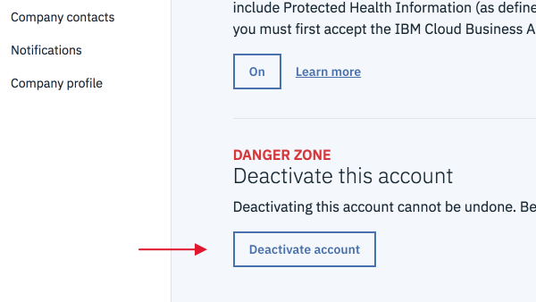

---

copyright:

  years: 2015, 2018

lastupdated: "2018-11-16"

---

{:shortdesc: .shortdesc}
{:codeblock: .codeblock}
{:screen: .screen}
{:new_window: target="_blank"}
{:faq: data-hd-content-type='faq'}

# FAQs
{: #billusagefaqs} 

## How do I update my credit card?
{: #updatecard}
{: faq}

To add or change your payment details, go to **Manage > Billing and usage** in the {{site.data.keyword.Bluemix}} console, and select **Payments**. Then, click **Payment method**.

## Why won't my credit card go through?
{: #addcard}
{: faq}

Protecting your identity is a priority for us, so we take credit card verification seriously. Contact us by calling the following number.  

   * Call us: 1-866-325-0045 (Select option 3)

## Are feature codes the same as promo codes? 
{: #entercode}
{: faq}

Feature codes and promo codes aren't the same. Promo codes are infrastructure-specific and are entered at checkout to get a discount on an order. Feature codes are used to offer extra resources or capabilities for Lite accounts and are needed to add subscription and support credits to Pay-As-You-Go and Subscription accounts. To redeem your feature code, go to **Manage > Account**, and select **Account settings**. Then, click **Apply code**. 

## How do I cancel my account?
{: #cancelmyaccount}
{: faq}

If you have an eligible account type, go to **Manage** > **Account** > **Account settings**, and click **Deactivate Account**. 

If you go to the **Account settings** page and the **Deactivate Account** is not displayed, you can get in touch by calling 1-866-325-0045 and selecting the third option, or open a [support case](https://{DomainName}/unifiedsupport/supportcenter){: new_window} .

## How do I delete my account?
{: #deleteaccount}
{: faq}

Contact [{{site.data.keyword.Bluemix_notm}} Support ](https://{DomainName}/unifiedsupport/supportcenter){: new_window} to open a support case and request to delete your account. If you have data that is associated with your old account that you want to move to a new account, include this information in your email.

## How do I get support?
{: #contactsupport}
{: faq}

Click **Support** in the console menu bar to access the Support Center. From there, start with leveraging the list of common FAQs. If you don't find the answers you need, click **Create a case** to get in touch with the support team.   

## How many apps can I build?
{: #howmanyapps}
{: faq}

In a Lite account, your apps have up to 256 MB of instantaneous runtime memory. You can deploy apps until you use the available Lite account allowance. If you need more memory, upgrade to a billable account to get 512 MB of free instantaneous runtime memory and pay only for what you use over that. There's no limits to the number of apps you can build in a billable account. 

## What happens if my Lite plan instance reaches the monthly quota?
{: #monthlyquota}
{: faq}

When you reach any quota limit for Lite plan instances, the service for that month is suspended. Quota limits are per org, not per instance. New instances that are created in the same org show any usage from previous instances. The quota limits reset on the first of every month.

## What can I order with my Subscription account? 
{: #subs-order}
{: faq}

You can order platform and infrastructure offerings from the {{site.data.keyword.Bluemix_notm}} catalog. 

## How do I qualify for a discount on a Subscription account? 
{: #subs-discount}
{: faq}

To qualify for a pricing discount, you must commit to a combined minimum spending and term commitment of $100.00 USD each month for 12 months. 

## Is there a monthly minimum amount required for Subscription accounts? 
{: #subs-minimum}
{: faq}

Yes, you must spend a minimum of $100.00 USD each month.

## What am I charged if I go over the total amount of my Subscription?
{: #subs-overage}
{: faq}

You're charged the non-discounted rate for any usage that goes over your total Subscription amount.

## Can I pay the total spending commitment up-front or quarterly?
{: #subs-pay-schedule}
{: faq}

Currently, you can make monthly payments to your Subscription account. If you'd like to pay up-front or quarterly, contact [{{site.data.keyword.Bluemix_notm}} Sales](https://www.ibm.com/cloud-computing/bluemix/contact-us){: new_window} .

## Can I spend more or less than my monthly commitment?  
{: #subs-spending}
{: faq}

Yes, what you spend monthly is up to you! You can spend any amount of the total commitment each month. 

## Can I cancel my Subscription account before the end of my term commitment?  
{: #subs-cancel-early}
{: faq}

Yes, you can cancel your account before your term expires, but the rest of your total Subscription amount is forfeited. 

## What happens if I reach my spending commitment before my term ends?  
{: #subs-spend-before-term-end}
{: faq}

You're required to continue paying your monthly charges until the end of your term. To avoid generating overage charges, contact [{{site.data.keyword.Bluemix_notm}} Sales](https://www.ibm.com/cloud-computing/bluemix/contact-us){: new_window}  for help with signing up for a new Subscription. 

## Where can I access my invoice?
{: #access-invoices}
{: faq}

From the console, click **Manage > Billing and usage**, and select **Invoices**..

## Why does my usage not match my invoice?
{: #usage-not-match-invoice}
{: faq}

Your usage might not match your invoice because the months that are used to compare usage aren't the same, or the total amount of the orgs wasn't selected. For more information, see [Viewing your usage](/docs/billing-usage/viewing_usage.html#viewingusage). If it still doesn't match, get in touch with us by calling 1-866-325-0045 and choosing the third option, or by opening a [support case](/unifiedsupport/cases/add).

