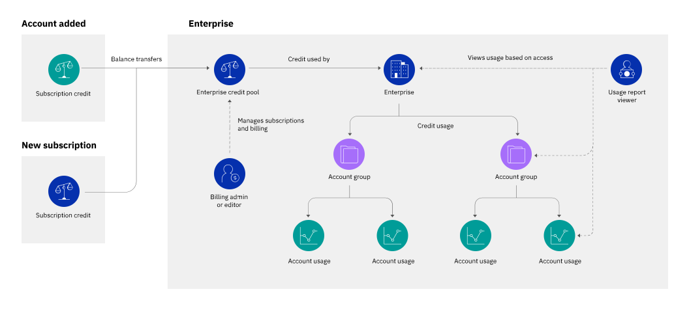

---

copyright:
  years: 2019, 2021
lastupdated: "2021-06-24"

keywords: enterprise billing, enterprise, subscription, billing unit, billing option, invoice, credit pool

subcollection: billing-usage

---

{:shortdesc: .shortdesc}
{:codeblock: .codeblock}
{:tip: .tip}
{:screen: .screen}
{:note: .note}
{:term: .term}
{:external: target="_blank" .external}

# Centrally managing billing and usage with enterprises
{: #enterprise}

You can centrally manage multiple {{site.data.keyword.Bluemix}} accounts with [Enterprises](#x2026915){: term}. Because billing is separate from the individual child accounts and consolidated to the enterprise level, enterprises simplify managing billing, invoicing, and payments for the accounts.
{: shortdesc}

New to {{site.data.keyword.Bluemix_notm}} enterprises? See [What is an enterprise?](/docs/account?topic=account-what-is-enterprise) for more details about how enterprises can help you centrally manage billing and usage.
{: tip}

## Enterprise billing model
{: #enterprise-billing-basics}

In an enterprise, billing is managed by the enterprise rather than in the individual child accounts. This centralized billing model differs from a stand-alone account in the following ways.

 * Credit from any existing subscriptions or promotions in accounts that are added to the enterprise is consolidated into the enterprise's credit pool. The billing administrator adds new subscriptions to the credit pool from the enterprise account.
 * Usage from all accounts is deducted from the shared credit pool. If given access, enterprise users can view usage costs for all accounts and account groups in the enterprise. Users within each child account can continue to monitor usage in the particular account, but they don't have visibility to other accounts in the enterprise.
 * Usage is invoiced through the enterprise account. Only the enterprise billing administrator can view invoices and manage payments.

<figure>

<figcaption>Figure 1. Enterprise billing and usage management</figcaption>
</figure>

## Billing options
{: #enterprise-billing-options}

Enterprises require subscription billing. With subscription billing, you purchase a subscription for an amount of credit to spend during the subscription term, and usage is deducted from the subscription credit at a discounted rate. The account that you use to create the enterprise must be a [Subscription account](/docs/account?topic=account-accounts#subscription-account). After the enterprise is created, you can add more accounts to the enterprise. If you add a Lite or trial account, the account is automatically upgraded to a Pay-As-You-Go account.

Some Pay-As-You-Go accounts can't be directly imported into an enterprise, such as many Pay-As-You-Go accounts that are billed in United States dollars (USD). However, you can still import these accounts into your enterprise by converting them to Subscription accounts and then importing them. To convert an account, contact [{{site.data.keyword.Bluemix_notm}} Sales](https://cloud.ibm.com/catalog?contactmodule){: external}.
{: note}

Each enterprise supports only a single billing currency. All accounts must use the enterprise billing currency before you add them to the enterprise. Existing accounts that are imported into the enterprise no longer separately manage their billing. As a result, subscription credit can't be added to individual child accounts. Subscription credit must be added to the enterprise account, where it becomes part of the enterprise credit pool.

### Billing transition when importing accounts
{: #billing-transition}

When you import an existing account to an enterprise, its billing and invoicing transitions to being managed by the enterprise account. This transition includes the following changes to the account.

   * For Subscription accounts that are added, the account type is changed to Pay-As-You-Go. This change reflects that the account does not have its own subscriptions, but it still has full access to production-ready, billable services.
   * Subscriptions and promotions from each account are moved to the enterprise account, where they become part of the credit pool. After the move, each subscription has the same remaining credit and term period, but the subscription is given a new unique ID.
   * Access to billing and payment information for future billing periods is restricted to users in the enterprise account. Users in a child account can't access billing and payment information, such as invoices, payments, or subscriptions, even if they previously had access in the account. To view or manage billing, users need to be invited to the enterprise account and given access to the Billing service in that account.
   * Usage is invoiced to the enterprise account for the entire month when the account was added. For example, if you add an account to the enterprise on 15 June, all of the usage for the month of June is reflected in the July invoice.

### Shared credit pool
{: #credit-pool}

The enterprise credit pool consolidates credit from all accounts in the enterprise and shares it with the accounts. The pool includes credit from all sources, including platform subscription credit, promotional credit, and support credit. When accounts in the enterprise create and use resources, the cost for this usage is deducted from the credit pool.

When existing subscriptions are added to the enterprise, each individual subscription term is re-created within the credit pool, including characteristics such as the remaining credit balance, start dates, and end dates. As credit is used, the subscription terms burn down individually according to when they expire. For example, you imported two accounts with existing subscriptions in August 2019. One subscription, `32100456`, is for $1,000 for 18 months that began in January 2019. Because it spans multiple years, the subscription is divided into terms of up to one year each. The other subscription, `55543210` is for $500 a month for two years that began in April 2019, which is also divided into multiple terms. Then, you purchased a new one-year subscription, `00012345`, through your enterprise for $1,500 a month that starts in July 2020. As enterprise users use resources, credit is deducted from the first term from subscription `32100456` because it expires the soonest, then the first term from subscription `55543210` because it expires next, and so on. This behavior ensures optimum usage of your purchased subscription credit.

| Originating Subscription | Remaining Credit | Valid From | Valid Until |
| --- | --- | --- | --- |
| {{site.data.keyword.Bluemix_notm}} Platform - 32100456, term 1 | $5,000       | 2019-01-01 | 2019-12-31 |
| {{site.data.keyword.Bluemix_notm}} Platform - 55543210, term 1 | $4,000       | 2019-04-01 | 2020-03-31 |
| {{site.data.keyword.Bluemix_notm}} Platform - 32100456, term 2 | $6,000       | 2020-01-01 | 2020-06-30 |
| {{site.data.keyword.Bluemix_notm}} Platform - 55543210, term 2 | $6,000       | 2020-04-01 | 2021-03-31 |
| {{site.data.keyword.Bluemix_notm}} Platform - 00012345 | $18,000       | 2020-07-01 | 2021-06-30 |
| **Credit pool total**                                  | **$39,000**  |   **--**   |   **--**   |
{: caption="Table 1. Subscriptions in an enterprise credit pool" caption-side="top"}
{: summary="This table has column headers and a summary row. The row headers identify the subscription and attributes. The last row has a header in the first column and a summation of values from previous rows in the second column."}

The billing administrator in the enterprise account can view and monitor the total amount of available credit in the enterprise dashboard. If more credit is needed to cover the enterprise's usage, a new subscription can be purchased and then added to the enterprise account.

Subscriptions can be added only to the enterprise account and cannot be added to other accounts in the enterprise.
{: note}

Because subscriptions can be sized for the entire enterprise rather than per account, you get the following benefits:
   * Simpler subscription sizing because the subscriptions apply to more than one account
   * Better discounts on usage costs because subscriptions are larger
   * Fewer expiration dates to track and manage after existing subscriptions expire

In an enterprise, subscriptions are managed from the enterprise account the same way as for a stand-alone account. For more information about managing your platform and support subscriptions, see [Managing subscriptions](/docs/billing-usage?topic=billing-usage-subscriptions).

## Usage reporting
{: #enterprise-usage-reporting}

Enterprises provide top-down usage reporting so that you can track the costs of resource usage from all accounts in the enterprise. Starting at the enterprise level, you can navigate within the enterprise structure to see the estimated usage costs within each account or account group. At the account level, enterprise users can view costs for each type of resource or service in the account.

Enterprise administrators can provide granular access to users so that they can view usage only for certain account groups or accounts. For example, say that your enterprise has account groups for each department, and each department has account groups for each team.
   * You give your financial officer access to view the entire enterprise so that they can track and recover costs for each department.
   * You give each department lead access to view usage for everything in their department's account group.
   * You give each team lead access to view only the accounts in their team's account group.

Because access in the enterprise is separate from access in each account, enterprise users can't automatically manage resources within the child accounts. Similarly, users in each account can continue to view their past and current usage from the Usage page regardless of whether they have enterprise access.

You can view usage from the Usage page in the console, from the CLI, or from the Enterprise Usage Reports API. For more information, see [Viewing usage in an enterprise](/docs/billing-usage?topic=billing-usage-enterprise-usage).

## Invoicing and payments
{: #enterprise-invoicing}

Usage in the enterprise is invoiced through the enterprise account. As with all billable accounts, usage is invoiced monthly, and the invoice is due on the billing date for your account. During each billing cycle, a single invoice with the usage costs from all accounts is made available in the enterprise account. The invoice contains costs for all platform and infrastructure usage as a single-line item in your invoice. If all of the credit in the credit pool is used, the invoice contains a line item for any overage charges.

Because all usage is invoiced through the enterprise account, child accounts within the enterprise don't receive separate invoices.

You can analyze usage costs for each account or account group on the Usage page in the enterprise account. For details, see [Viewing usage in an enterprise](/docs/billing-usage?topic=billing-usage-enterprise-usage).
{: tip}

## Access management for enterprise billing and usage
{: #enterprise-billing-access}

As with other enterprise management roles, access to enterprise billing and usage is managed through the enterprise account. Users must be invited to the enterprise account and assigned an access policy with a role on the relevant service.

In an enterprise, billing access and usage access are assigned separately.

   * Billing access is provided by assigning enterprise users a role on the Billing account management service. For example, you can assign the Viewer role to an enterprise user so that they can view the amount of available subscription credit in the credit pool. If you would like an enterprise user to be able to add new subscriptions or manage payment methods, you can assign the Editor or Administrator role to them.
   * Usage access is provided by assigning enterprise users the Usage Reports Viewer, Editor, or Administrator role on the Enterprise account management service. You can assign this access for the entire enterprise or for specific account groups and accounts.

If you want your billing administrator to be able to view costs by account or account group, assign them the appropriate access on both the Enterprise service and Billing service.
{: tip}

For more information, see [User and access management for enterprises](/docs/account?topic=account-assign-access-enterprise).
