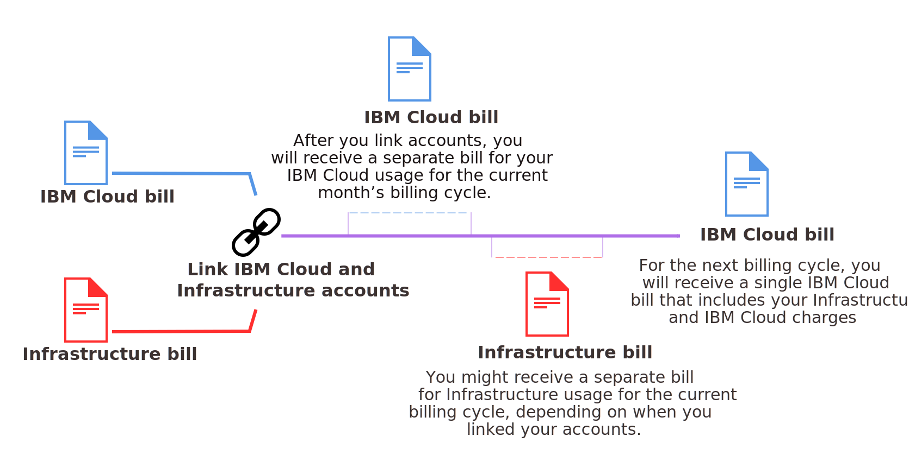

---

copyright:

  years: 2015, 2018
lastupdated: "2018-04-12"

---

{:shortdesc: .shortdesc}
{:codeblock: .codeblock}
{:screen: .screen}
{:tip: .tip}
{:new_window: target="_blank"}

# Consolidated billing for linked accounts
{: #unifybillaccounts}

When you link your {{site.data.keyword.Bluemix_notm}} and Softlayer accounts, you receive a single {{site.data.keyword.Bluemix_notm}} invoice. If you have an existing {{site.data.keyword.Bluemix_notm}} account, the billing through {{site.data.keyword.Bluemix_notm}} for infrastructure resources takes effect for the new billing cycle that starts after the accounts are linked.
{: shortdesc}

All linked accounts in {{site.data.keyword.Bluemix_notm}} must be Pay-As-You-Go or Subscription accounts.
{: tip}

## Billing for {{site.data.keyword.Bluemix_notm}} usage when accounts are linked
{: #linkedbilling}

After you link your {{site.data.keyword.Bluemix_notm}} and SoftLayer billing accounts, the next billing cycle is charged in a single {{site.data.keyword.Bluemix_notm}} bill.

Your {{site.data.keyword.Bluemix_notm}} usage cycle is on a calendar month basis, so your account is billed each month on the billing day that was established for your charge agreement. With SoftLayer, your usage cycle begins from when you started with SoftLayer, so you are billed each month on the same day of the month as when you signed up for your SoftLayer account.

Your {{site.data.keyword.Bluemix_notm}} usage continues to be measured for the current month's cycle, and you are billed for that usage on a {{site.data.keyword.Bluemix_notm}} invoice. Starting on the first of the next month, your {{site.data.keyword.Bluemix_notm}} and SoftLayer charges are combined on your {{site.data.keyword.Bluemix_notm}} invoice.

For example, if you link your accounts on 16 April 2017, you get a {{site.data.keyword.Bluemix_notm}} invoice for your April usage. Depending on when you linked your accounts, you might get a separate bill for your SoftLayer usage. Then, your combined usage during May is billed through your {{site.data.keyword.Bluemix_notm}} account.

After your bills are linked, your {{site.data.keyword.Bluemix_notm}} invoice lists the different charges for each resource that you have used.

## API-based {{site.data.keyword.Bluemix_notm}} services
{: #api-based-services}

The following list contains the services that you can set up to run with your application code. Not all plans for these services are available for use with linked accounts. Only the plans enabled for Pay-As-You-Go and Subscription accounts are available to use with linked accounts. However, if you have a separate {{site.data.keyword.Bluemix_notm}} account that's billed separately, you can use any plan for any of these services.

* {{site.data.keyword.alertnotificationshort}}
* {{site.data.keyword.sparks}}
* {{site.data.keyword.appseccloudshort}}
* {{site.data.keyword.blockchain}}
* {{site.data.keyword.cloudant}}
* {{site.data.keyword.iotmapinsights_short}}
* {{site.data.keyword.dashdbshort}}
* {{site.data.keyword.weather_short}}
* {{site.data.keyword.iotdriverinsights_short}}
* {{site.data.keyword.geospatialshort_Geospatial}}
* {{site.data.keyword.iotelectronics}}
* {{site.data.keyword.languagetranslationshort}}
* {{site.data.keyword.messagehub}}
* {{site.data.keyword.nlclassifiershort}}
* {{site.data.keyword.objectstorageshort}}
* {{site.data.keyword.personalityinsightsshort}}
* {{site.data.keyword.servicediscoveryshort}}
* {{site.data.keyword.speechtotextshort}}
* {{site.data.keyword.sqldb}}
* {{site.data.keyword.streaminganalyticsshort}}
* {{site.data.keyword.texttospeechshort}}
* {{site.data.keyword.toneanalyzershort}}
* {{site.data.keyword.visualrecognitionshort}}
* {{site.data.keyword.workloadscheduler}}
