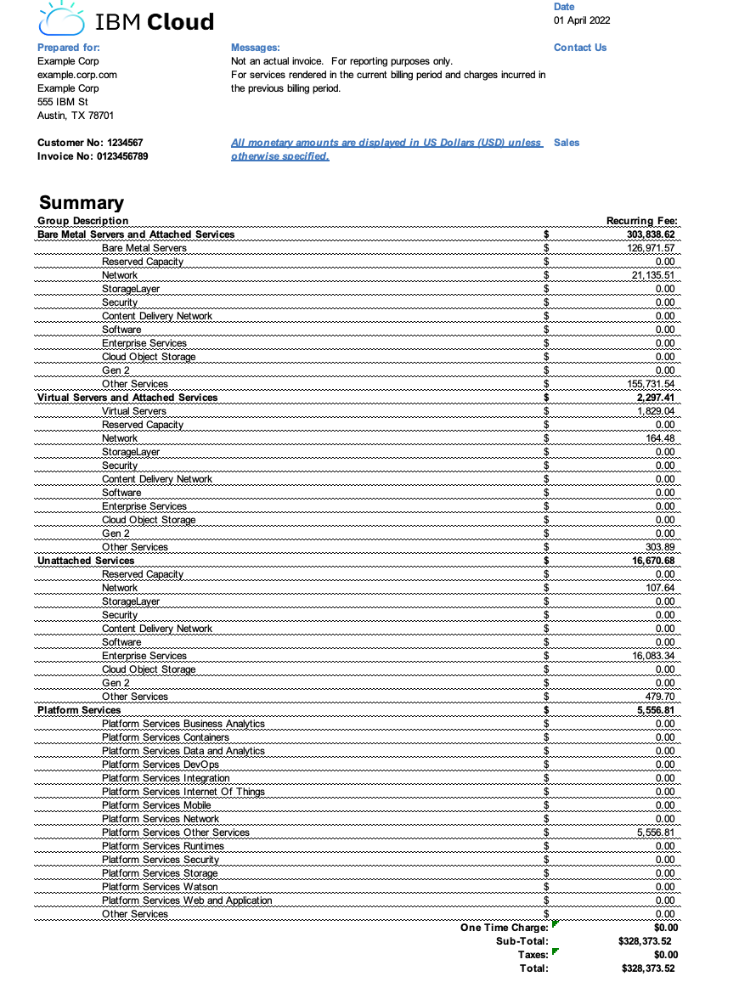
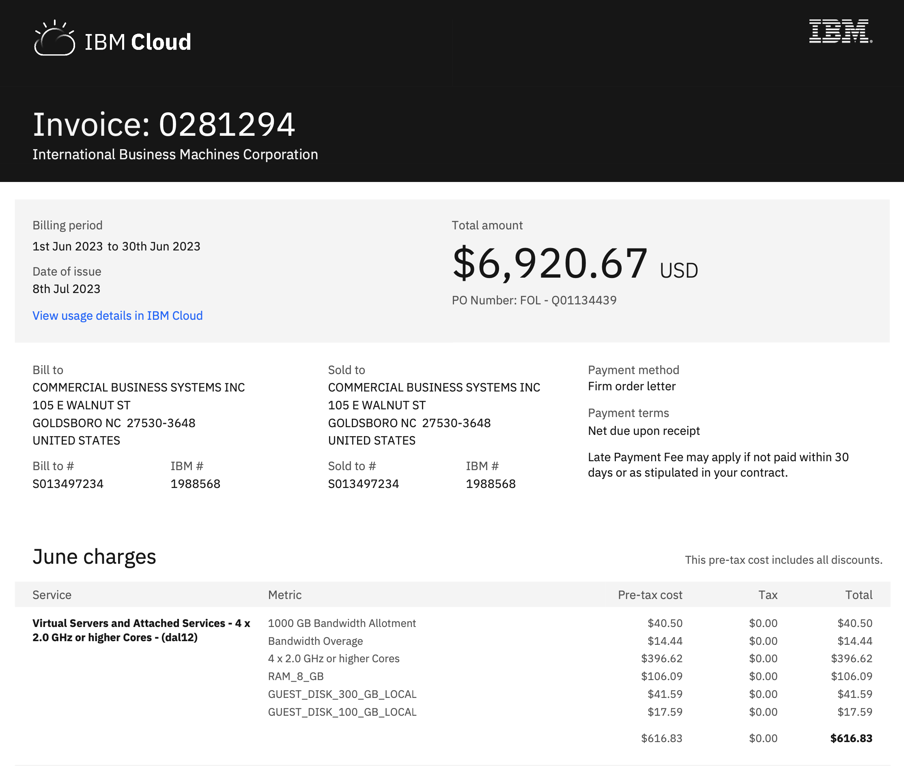
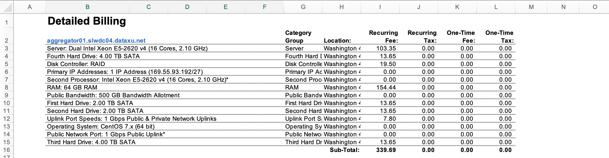
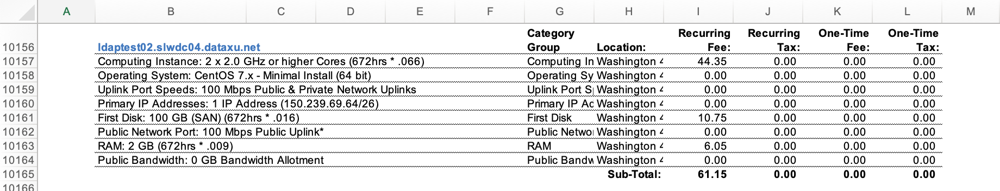
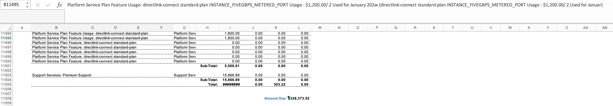

---

copyright:
  years: 2024
lastupdated: "2024-06-11"

keywords: IBM Cloud billing, commitment model, using commitments, pay as you go with committed use, enterprise savings plan

subcollection: billing-usage

---

{{site.data.keyword.attribute-definition-list}}

# Moving to {{site.data.keyword.IBM_notm}} billing systems
{: #migrate-to-simple}

If you receive invoices like the one in [Figure 1.](#old-invoice) then your account or accounts must move to {{site.data.keyword.IBM_notm}} billing systems before 31 October 2024. You continue to enjoy the same services, pricing, and terms without any disruptions.
{: shortdesc}

If you're an IBM Business Partner, see [Moving to {{site.data.keyword.IBM_notm}} Partner Programs](link).
{: note}

## Before you begin
{: #before-billing-migration}

Review the following upgrades and impacts to your billing experience:

- Usage is now billed from the first to the last day of each month, with a single, consolidated invoice issued on the 8th of the following month.
- During the transition to this new billing cycle, you might see prorated charges for services that are billed on different schedules. For example, advance-billed services, monthly servers, or hourly usage products that are billed in arrears.
- The business entity and credit card merchant that is used to bill your account is changing, so the company name that is displayed on your credit card statement will change.

## Invoicing schedule and format
{: #invoice-compare}

The invoice in Figure 1. includes charges from multiple months on one invoice. For example, an invoice that you recieve in December consists of charges for differnt types of services, and each type of service has a differnet billing cycle. Review the following table to understand how usage is billed for a December invoice:

| Serivce type | Example services | Usage for the month of | Billed       | Invoiced in |
|--------------|------------------|------------------------|--------------|-------------|
| Classic Infrastructure	(Monthly) | Bare Metal, Virtual Servers  | December             | In advance   | December |
| Classic Infrastructure	(Hourly)  | Bare Metal, Virtual Servers  | November             | In arrears   | December |
| Other Classic Infrastructure charges | Bandwidth Overages, Image Template Storage | November | In arrears | December
| Platform                          | Watson, DevOps               | October              | In arrears (2 months)  | December |
{: caption="Table 1. Your old invoice has usage for different months on the same invoice." caption-side="bottom"}

{: caption="Figure 1. The invoice that you might currently recieve." caption-side="bottom"}
{: #old-invoice}

The new invoice you will recieve in Figire 2. includes only charges from the previous month. This way, usage for all types of services are billed on the same cycle. For example, Table 2. shows that charges accrued for all three major types of usage in November are billed on the same invoice in December.

| Serivce type | Example services | Usage for the month of | Billed       | Invoiced in |
|--------------|------------------|------------------------|--------------|-------------|
| Classic Infrastructure	(Monthly) | Bare Metal, Virtual Servers  | November             | In arrears   | December |
| Classic Infrastructure	(Hourly)  | Bare Metal, Virtual Servers  | November             | In arrears   | December |
| Platform                          | Watson, DevOps               | November             | In arrears   | December |
{: caption="Table 2. Your new invoice has usage from only othe previous month on the invoice that you receive 8 days into the folowing month." caption-side="bottom"}

{: caption="Figure 2. The invoice that you will recieve after moving to IBM billing systems." caption-side="bottom"}
{: #new-invoice}

## Finding detailed billing
{: #find-detials}

Your old invoice has granular instance level usage information on the Detailed Billing tab. The Detailed Billing tab provides a breakdown of all of your infrastructure and platform charges that represent three major types of usage. Review the following sections to understand how your old experience maps to your new experience for a seamless transition.

### Your old experince
{: #old-instance-details}

To locate your old invoice, you would have completed the following steps:

1. In the {{site.data.keyword.cloud_notm}} console, go to **Manage** > **Billing and usage**, and select **Invoices**.
1. Click the invoice number. For this example, review the table and click the invoice with a 3/1/22 date of issue and recurring type.
1. To download the recurring invoice, click the **Download** icon  and select Excel invoice.
1. Click **Email selected documents**. You receive an email with the selected documents to the email address of the account that you're logged in to. You can also click the **Download** icon  to download the invoice directly to your device.
1. Open the downloaded file, and click **Detailed Billing** tab.

Using Table 1. as an example, you might see similar charges to the following on an invoice that you recieve in December for the three major types of usage:

#### In Advance infrastructure monthly usage charges
{: #advance-monthly}

On an invoice that you recieve for the month of December, infrastructure monthly usage is charged in advance. These are recurring charges that you incur until you cancel the service. The charge is the same every month.

{: caption="Figure 4. In advance infrastructure monthly usage charges." caption-side="bottom"}

#### In Arrears infrastructure hourly charges
{: #arrears-hourly}

On an invoice that you recieve for the month of December, infrastructure hourly usage is charged one month in arrears for the month of November. These are usage-based charges from the previous month. Note the `672 hrs * .066` format of the charges. In arrears, infrastructure hourly charges are always in this format.

{: caption="Figure 5.In Arrears infrastructure hourly charges." caption-side="bottom"}

#### In Arrears platform service charges
{: #arrears-platform}

On an invoice that you recieve for the month of December, platform service usage is charged 2 months in arrears for the month of October. These are usage-based charges from two months prior. They are labeled Platform service in column B and reference the month in which the usage was consumed.

{: caption="Figure 6. In arrears platform service charges for the month of January." caption-side="bottom"}

### Your new experince
{: #new-instance-details}

With your new billing experience, all three major usage types are now billed a single month in arrears and your new instance level usage report includes only charges accrued in the previous month. Aligning all usage types to the same billing cycle makes chargebacks for different teams in your organization quicker and easier.

You can find instance level details for your monthly usage by completing the following steps:

1. In the console, go to **Manage > Billing and usage**, and select **Usage**.
1. Click **Export CSV**.
1. Select **Instance** for detailed usage information about each service instance.

## Updating your billing information
{: #initiate-migration}

As the owner of an account that uses a credit card as the payment method, you can initiate your move to {{site.data.keyword.IBM_notm}} billing systems by updating your billing and account information. Log in to the {{site.data.keyword.Bluemix_notm}} console and view the banner notification on your dashboard. Click **Update now** to update the necessary information for your account.

If your account uses a PO box address, you're required to provide a physical address.
{: note}

If you don't receive a console notification that prompts you to update your information, contact an [{{site.data.keyword.cloud_notm}} Sales](https://www.ibm.com/cloud?contactmodule){: external} representative to migrate your account. If you're an IBM Business Partner, see [Moving to IBM Partner Programs](link).

## Finding your invoices
{: #new-invoices}

After your move to {{site.data.keyword.IBM_notm}} billing systems is complete, your new invoices include charges from the first to the last day of the previous month. Now, you receive your invoice from the previous month on the 8th of the next month. For example, an invoice that you receive on 8 April includes only usage from 1 March to 31 March.

You can find your new invoices in the {{site.data.keyword.Bluemix_notm}} console by going to **Manage > Billing and usage > Invoices**. View a history of your old invoices at [cloud.ibm.com/gen1-invoices](cloud.ibm.com/gen1-invoices).

## Helpful links
{: #helpful-billing-migrate}

- [Make a one-time payment](/docs/billing-usage?topic=billing-usage-linkedusage#makepayment)
- [Viewing your invoices](/docs/billing-usage?topic=billing-usage-managing-invoices)
- [Managing payments](/docs/billing-usage?topic=billing-usage-linkedusage)
- [Understanding my invoice](/docs/billing-usage?topic=billing-usage-understand-invoices)
- [Viewing your usage](/docs/billing-usage?topic=billing-usage-viewingusage&interface=ui)

## Getting support
{: #esp-support}

Need help? [Open a support case](/unifiedsupport/supportcenter), or call our support team at +1-866-398-7638.
