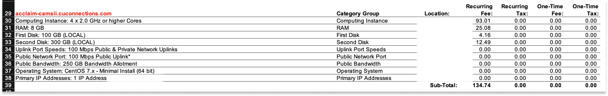
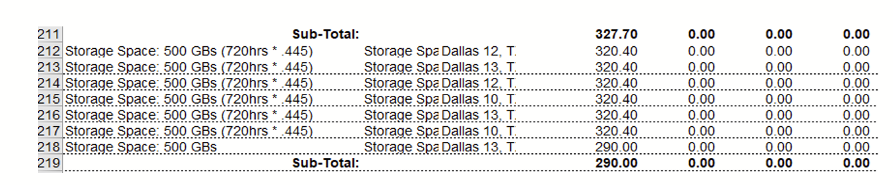
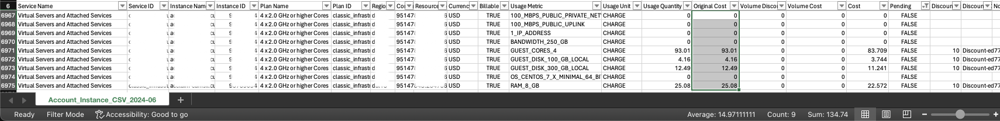
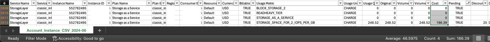
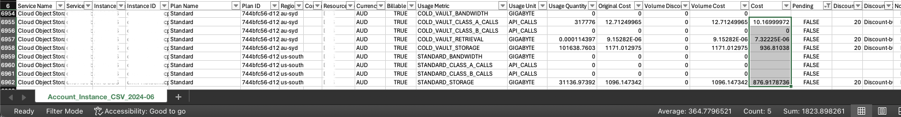

---

copyright:
  years: 2024
lastupdated: "2024-08-05"

keywords: IBM Cloud billing, commitment model, using commitments, pay as you go with committed use, enterprise savings plan

subcollection: billing-usage

---

{{site.data.keyword.attribute-definition-list}}

# Moving to {{site.data.keyword.IBM_notm}} billing systems
{: #migrate-to-simple}

A segment of customers that use a legacy billing system must move their accounts to {{site.data.keyword.IBM_notm}} billing systems before 31 October 2024. If you receive invoices like the example in [Figure 1.](#old-invoice) and you pay your invoice on the [Invoices](/billing/invoices) page in the {{site.data.keyword.Bluemix}} console, this applies to your account. You will continue to enjoy the same services, pricing, and terms without any disruptions. This transition provides you an enhanced usage and invoicing experience.
{: shortdesc}

Accounts that are required to move to {{site.data.keyword.IBM_notm}} billing systems are notified with a banner notification in the {{site.data.keyword.Bluemix}} console, an email notification, and a support case.

If you're an IBM Business Partner, see [Moving to {{site.data.keyword.IBM_notm}} Partner Programs](/docs/billing-usage?topic=billing-usage-migrate-to-partner).
{: note}

## Before you begin
{: #before-billing-migration}

Review the following upgrades and impacts to your billing experience:

- All usage will be billed one month in arrears. For example, all classic and platform usage that you consume in the month of June is invoiced in July. A single, consolidated invoice for one month of usage is issued on the eighth of the following month.
- During the transition to this new billing cycle, you might see prorated charges for services that were billed on different schedules. For example, you might have monthly infrastructure services that are billed in advance, hourly usage products that are billed one month in arrears, or platform resources billed two months in arrears. The new billing cycle aligns all services to a one-month in arrears model.
- The company name that is displayed on your credit card statement is changing.
- All usage information will be available on the [billing and usage dashboard](/billing/) in the {{site.data.keyword.cloud}} console. Your old experience doesn't include a consilidated view of your platform and classic infrastructure usage.

All prices that are mentioned in this topic are illustrative and do not represent the actual amounts that are used for billing. To calculate pricing, use the [cost estimator](/estimator).
{: note}

## Updating your billing information
{: #initiate-migration}

As the owner of an account that uses a credit card as the payment method, you can initiate your move to {{site.data.keyword.IBM_notm}} billing systems by updating your billing and account information. Log in to the {{site.data.keyword.Bluemix_notm}} console and view the banner notification on your dashboard. Click **Update now** to update the necessary information for your account.

You must provide a physical address under Company information. A PO box address is not accepted.
{: note}

## Invoicing schedule and format
{: #invoice-compare}

The billing cycle for different types of services is changing. The format of your invoice is also being updated. Review the following sections to understand how your old experience maps to your new experience for a seamless transition.

### Your old experience
{: #old-schedule}

You might currently receive an invoice like the example in Figure 1., which includes charges that were incurred during different months on a single invoice. For example, an invoice that you receive in July consists of charges for different types of services, and each type of service has a different billing cycle.

{: caption="Figure 1. The invoice that you might currently receive." caption-side="bottom"}
{: #old-invoice}

Review the following table to understand how usage is billed on a July invoice that uses your old invoicing schedule:

| Service type | Example services | Usage for the month of | Billed       | Invoiced in |
|--------------|------------------|------------------------|--------------|-------------|
| Classic Infrastructure	(Monthly) | Bare Metal, Virtual Servers  | July             | In advance   | July |
| Classic Infrastructure	(Hourly)  | Bare Metal, Virtual Servers  | June             | In arrears   | July |
| Platform                          | Watson, DevOps, VPC          | May              | In arrears (2 months)  | July |
{: caption="Table 1. Your old invoice has usage for different months on the same invoice." caption-side="bottom"}

### Your new experience
{: #new-schedule}

The new invoice that you receive, shown in Figure 2., includes only charges from the previous month. This way, usage for all types of services are billed on the same cycle.

{: caption="Figure 2. The invoice that you receive after you move to IBM billing systems." caption-side="bottom"}
{: #new-invoice}

For example, Table 2. shows that charges accrued for all three major types of usage in June are billed on the same invoice in July.

| Service type | Example services | Usage for the month of | Billed       | Invoiced in |
|--------------|------------------|------------------------|--------------|-------------|
| Classic Infrastructure	(Monthly) | Bare Metal, Virtual Servers  | June             | In arrears   | July |
| Classic Infrastructure	(Hourly)  | Bare Metal, Virtual Servers  | June             | In arrears   | July |
| Platform                          | Watson, DevOps, VPC          | June             | In arrears   | July |
{: caption="Table 2. Your new invoice has usage from only the previous month on the invoice that you receive eight days into the following month." caption-side="bottom"}

## Finding detailed billing
{: #find-detials}

Your old invoice has granular details about instance level usage on the Detailed Billing tab. The Detailed Billing tab provides a breakdown of all of your infrastructure and platform charges that represent three major types of usage. Review the following sections to understand how your old experience maps to your new experience for a seamless transition.

### Your old experience
{: #old-instance-details}

To locate your old invoice, you would have completed the following steps:

1. In the {{site.data.keyword.cloud_notm}} console, go to **Manage** > **Billing and usage**, and select **Invoices**.
1. Click the invoice number.
1. To download the recurring invoice, click the **Download** icon  and select Excel invoice.
1. Click **Email selected documents**. You receive an email with the selected documents to the email address of the account that you're logged in to. You can also click the **Download** icon  to download the invoice directly to your device.
1. Open the downloaded file, and click **Detailed Billing** tab.

Using Table 1. as an example, you might see the following types of usage charges on an invoice that you receive in June:

#### In Advance infrastructure monthly charges
{: #advance-monthly}

On an invoice that you receive in the month of July, infrastructure monthly usage is charged in advance. These charges in advance are recurring until you cancel the service. The charge is the same every month.

{: caption="Figure 4. In advance infrastructure monthly usage charges." caption-side="bottom"}
{: #figure-4}

See how the `Recurring Fee` in Figure 4. matches the sum of the `Original cost` column in [Figure 7](#new-monthly). You'll notice that the `Cost` column in your new instance usage report gives you more insight into what you pay by including any discounts.

#### In Arrears infrastructure hourly charges
{: #arrears-hourly}

On an invoice that you receive in the month of July, hourly infrastructure usage is charged one month in arrears for the month of June. These charges are usage-based from the previous month.

{: caption="Figure 5. In Arrears infrastructure hourly charges." caption-side="bottom"}
{: #figure-5}

See [Figure 8.](#new-details) for how hourly infrastructure charges appear on your new instance level report.

#### In Arrears platform service charges
{: #arrears-platform}

On an invoice that you receive in the month of July, platform service usage is charged two months in arrears for the month of May. These are usage-based charges from two months prior. They are labeled Platform service in column B and reference the month in which the usage was consumed.

{: caption="Figure 6. In arrears platform service charges." caption-side="bottom"}
{: #figure-6}

See [Figure 9.](#new-platform-details) for how platform charges appear on your new instance level report.

### Your new experience
{: #new-instance-details}

With your new billing experience, all three major usage types are billed a single month in arrears. Your new instance level usage report includes only charges that are incurred in the previous month. Aligning all usage types to the same billing cycle makes chargebacks for different teams in your organization quicker and easier.

You can find instance level details for your monthly usage by completing the following steps:

1. Go to **Manage > Billing and usage** in the {{site.data.keyword.Bluemix_notm}} console, and select **Usage**.
1. Click **Export CSV**.
1. Select **Instance** for detailed usage information about each service instance.

For more information about heading titles in your CSV report, see [Understanding your instances report](/docs/billing-usage?topic=billing-usage-exporting-your-usage&interface=ui#table-account-instance-csv).

#### In Arrears infrastructure monthly charges
{: #new-arrears-monthly}

Figure 7. is an example of how infrastructure monthly charges, which are now billed one month in arrears, are shown on a usage report at the instance level.

{: caption="Figure 7. In Arrears monthly infrastructure charges on your new instance level usage report." caption-side="bottom"}
{: #new-monthly}

See how the sum of the `Original cost` column in Figure 7. matches the `Recurring Fee` in [Figure 4](#figure-4). You'll notice that the `Cost` column in your new instance usage report gives you more insight into what you pay by including any discounts.

#### In Arrears infrastructure hourly charges
{: #new-arrears-hourly}

Figure 8. is an example of how infrastructure hourly charges, which are billed one month in arrears, are shown on a usage report at the instance level.

{: caption="Figure 8. In Arrears infrastructure hourly charges on your new instance level usage report." caption-side="bottom"}
{: #new-details}

See [Figure 5](#figure-5) for how infrastructure hourly charges appear on your old Billing Details tab.

#### In Arrears platform service charges
{: #new-arrears-platform}

Figure 9. is an example of how platform service charges, which are now billed one month in arrears, are shown on a usage report at the instance level.

{: caption="Figure 9. In Arrears platform service charges on your new instance level usage report." caption-side="bottom"}
{: #new-platform-details}

See [Figure 6](#figure-6) for how platform service charges appear on your old Billing Details section.

## Finding your invoices
{: #new-invoices}

After your move to {{site.data.keyword.IBM_notm}} billing systems is complete, your new invoices include charges from the first to the last day of the previous month. Now, you receive your invoice from the previous month on the eighth of the next month. For example, an invoice that you receive on 8 July includes only usage from 1 June to 30 June.

You can find your new invoices in the {{site.data.keyword.Bluemix_notm}} console by going to **Manage > Billing and usage > Invoices**. You can also view a history of your old invoices on the Classic [Invoices](/classic/account/invoices) page.

## Helpful links
{: #helpful-billing-migrate}

- [Make a one-time payment](/docs/billing-usage?topic=billing-usage-linkedusage#makepayment)
- [Viewing your invoices](/docs/billing-usage?topic=billing-usage-managing-invoices)
- [Managing payments](/docs/billing-usage?topic=billing-usage-linkedusage)
- [Understanding my invoice](/docs/billing-usage?topic=billing-usage-understand-invoices)
- [Viewing your usage](/docs/billing-usage?topic=billing-usage-viewingusage&interface=ui)

## Getting support
{: #migrate-support}

Need help? Refer to your open support case titled `IBM Cloud Billing Information Update Required` or call the support team at +1-866-398-7638.
