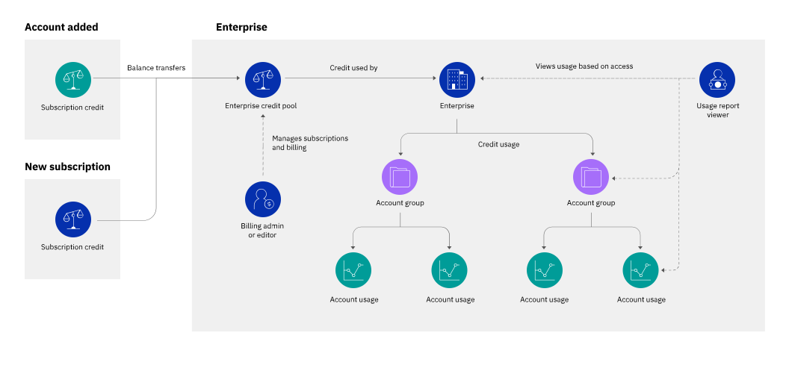

---

copyright:
  years: 2019
lastupdated: "2019-08-06"

keywords: enterprise billing, enterprise, subscription, billing unit, billing option, invoice, credit pool

subcollection: billing-usage

---

{:shortdesc: .shortdesc}
{:codeblock: .codeblock}
{:tip: .tip}
{:screen: .screen}
{:note: .note}
{:new_window: target="_blank"}

# Abrechnung und Nutzung zentral mit Unternehmen verwalten
{: #enterprise}

Unternehmen ermöglichen es Ihnen, mehrere {{site.data.keyword.Bluemix}}-Konten zentral zu verwalten. Da die Abrechnung von den einzelnen untergeordneten Konten getrennt und auf Unternehmensebene konsolidiert wird, vereinfachen die Unternehmen die Verwaltung der Abrechnung, Rechnungsstellung und Zahlungen für die Konten.
{: shortdesc}

Sie sind noch nicht mit dem Konzept des "Unternehmens" (Enterprise) bei {{site.data.keyword.Bluemix_notm}} vertraut? Weitere Informationen zur zentralen Verwaltung der Abrechnung und Nutzung mithilfe von Unternehmen finden Sie im Abschnitt [Was ist ein Unternehmen?](/docs/account?topic=account-enterprise).
{: tip}

## Abrechnungsmodell für Unternehmen
{: #enterprise-billing-basics}

In einem Unternehmen wird die Abrechnung durch das Unternehmen und nicht in den einzelnen untergeordneten Konten verwaltet. Dieses zentralisierte Abrechnungsmodell unterscheidet sich von einem eigenständigen Konto durch folgende Punkte:

 * Guthaben aus bereits vorhandenen Abonnements oder Werbeaktionen in Konten, die dem Unternehmen hinzugefügt werden, wird im Guthabenpool des Unternehmens konsolidiert. Der Abrechnungsadministrator fügt dem Guthabenpool neue Abonnements aus dem Unternehmenskonto hinzu.
 * Die Nutzung aus allen Konten wird vom gemeinsam genutzten Guthabenpool abgezogen. Wenn sie den entsprechenden Zugriff erhalten, können die Unternehmensbenutzer die Nutzungskosten für alle Konten und Kontogruppen im Unternehmen anzeigen. Die Benutzer innerhalb jedes untergeordneten Kontos können die Nutzung in dem jeweiligen Konto weiterhin überwachen, haben aber keinen Einblick in andere Konten im Unternehmen.
 * Die Nutzung wird über das Unternehmenskonto in Rechnung gestellt. Nur der Abrechnungsadministrator des Unternehmens kann Rechnungen anzeigen und Zahlungen verwalten.

<figure>

<figcaption>Abbildung 1. Abrechnungs- und Nutzungsmanagement in Unternehmen</figcaption>
</figure>

## Abrechnungsoptionen
{: #enterprise-billing-options}

Unternehmen erfordern eine Abonnementabrechnung, d. h. Sie erwerben ein Abonnement für ein bestimmtes Guthaben, das während der Laufzeit des Abonnements ausgegeben wird, und die Nutzung wird vom Abonnementguthaben zu einem ermäßigten Satz abgezogen. Das Konto, das Sie zur Erstellung des Unternehmens verwenden, muss ein [Abonnementkonto](/docs/account?topic=account-accounts#subscription-account) sein. Nachdem das Unternehmen erstellt wurde, können Sie dem Unternehmen jede Art von Konto hinzufügen. Wenn Sie ein Lite- oder Testkonto hinzufügen, erfolgt ein automatisches Upgrade auf ein nutzungsabhängiges Konto.

Einige nutzungsabhängige Konten können nicht direkt in ein Unternehmen importiert werden, wie z. B. zahlreiche nutzungsabhängige Konten, deren Abrechnung in US-Dollar (USD) erfolgt. Sie können diese Konten aber trotzdem in Ihr Unternehmen importieren, indem Sie sie in Abonnementkonten konvertieren und anschließend importieren. Wenn Sie ein Konto konvertieren möchten, wenden Sie sich an den [{{site.data.keyword.Bluemix_notm}}-Vertrieb](https://www.ibm.com/cloud-computing/bluemix/contact-us){: new_window} .
{: note}

Jedes Unternehmen unterstützt nur eine einzige Abrechnungswährung. Alle Konten müssen die Abrechnungswährung des Unternehmens verwenden, bevor Sie sie dem Unternehmen hinzufügen. Wenn vorhandene Konten in das Unternehmen importiert werden, wird die Abrechnung für diese Konten nicht mehr separat verwaltet. Als Ergebnis kann das Abonnementguthaben nicht einzelnen untergeordneten Konten hinzugefügt werden. Das Abonnementguthaben muss dem Unternehmenskonto hinzugefügt werden, wenn es Teil des Unternehmensguthabenpools wird.

### Übertragung der Abrechnung beim Hinzufügen von Konten
{: #billing-transition}

Wenn Sie ein vorhandenes Konto zu einem Unternehmen hinzufügen, werden die Abrechnung und Rechnungsstellung vom Unternehmenskonto übernommen. Diese Übernahme umfasst die folgenden Änderungen am Konto:

   * Bei Abonnementkonten, die hinzugefügt werden, wird der Kontotyp in "nutzungsabhängig" geändert. Diese Änderung bedeutet, dass das Konto nicht über eigene Abonnements verfügt, es aber immer noch vollen Zugriff auf produktionsbereite, abrechnungsfähige Services hat.
   * Abonnements und Werbeaktionen von jedem Konto werden auf das Unternehmenskonto übertragen, wo sie Teil des Guthabenpools werden. Nach der Übertragung hat jedes Abonnement dasselbe verbleibende Guthaben und dieselbe Restlaufzeit, aber es erhält eine neue eindeutige ID.
   * Der Zugriff auf Abrechnungs- und Zahlungsinformationen für zukünftige Abrechnungszeiträume ist auf die Benutzer im Unternehmenskonto beschränkt. Benutzer in einem untergeordneten Konto können nicht auf Abrechnungs- und Zahlungsinformationen zugreifen (wie z. B. Rechnungen, Zahlungen oder Abonnements), selbst wenn sie zuvor Zugriff auf das Konto hatten. Zum Anzeigen oder Verwalten der Abrechnung müssen die Benutzer für das Unternehmenskonto eingeladen werden und in diesem Konto Zugriff auf den Abrechnungsservice erhalten.
   * Die Nutzung wird dem Unternehmenskonto für den gesamten Monat in Rechnung gestellt, in dem das Konto hinzugefügt wurde. Wenn Sie zum Beispiel am 15. Juni ein Konto für das Unternehmen hinzufügen, wird die gesamte Nutzung für den Monat Juni in der Juli-Rechnung abgerechnet.

### Gemeinsam genutzter Guthabenpool
{: #credit-pool}

Der Guthabenpool des Unternehmens konsolidiert das Guthaben aus allen Konten im Unternehmen und stellt sie den Konten zur gemeinsamen Nutzung zur Verfügung. Der Pool umfasst Guthaben aus allen Quellen, einschließlich Plattformabonnementguthaben, Werbeguthaben und Supportguthaben. Wenn Konten im Unternehmen Ressourcen erstellen und verwenden, werden die Kosten für diese Nutzung vom Guthabenpool in Abzug gebracht.

Der Abrechnungsadministrator im Unternehmenskonto kann den Gesamtbetrag des verfügbaren Guthabens im Dashboard für das Unternehmen anzeigen und überwachen. Wenn mehr Guthaben benötigt wird, um die Nutzung des Unternehmens zu decken, kann ein neues Abonnement erworben und dann dem Unternehmenskonto hinzugefügt werden. Abonnements können nur dem Unternehmenskonto hinzugefügt werden. Sie können nicht anderen Konten im Unternehmen hinzugefügt werden.

Da Abonnements für das gesamte Unternehmen anstatt für ein Konto ausgelegt werden können, erhalten Sie die folgenden Vorteile:
   * Einfachere Abonnementdimensionierung, da die Abonnements für mehr als ein Konto gelten
   * Bessere Preisnachlässe bei Nutzungskosten, da die Abonnements umfangreicher sind
   * Weniger Verfallsdaten, die nach Ablauf vorhandener Abonnements verfolgt und verwaltet werden müssen

In einem Unternehmen werden Abonnements vom Unternehmenskonto aus genauso verwaltet wie bei einem eigenständigen Konto. Unter [Abonnements verwalten](/docs/billing-usage?topic=billing-usage-subscriptions) finden Sie weitere Informationen zum Verwalten Ihrer Plattform- und Supportabonnements.

## Nutzungsberichte
{: #enterprise-usage-reporting}

Unternehmen stellen Nutzungsberichte mit ansteigendem Detaillierungsgrad bereit, damit Sie die Kosten für die Ressourcennutzung von allen Konten im Unternehmen verfolgen können. Ausgehend von der Unternehmensebene können Sie innerhalb der Unternehmensstruktur navigieren, um die geschätzten Nutzungskosten innerhalb jedes Kontos oder jeder Kontogruppe anzuzeigen. Auf der Kontoebene können die Benutzer des Unternehmens die Kosten für jeden Ressourcentyp oder Service im Konto anzeigen.

Unternehmensadministratoren können einen differenzierten Zugriff auf Benutzer bereitstellen, damit sie die Nutzung nur für bestimmte Kontogruppen oder Konten anzeigen können. Beispiel: Ihr Unternehmen verfügt über Kontogruppen für jede Abteilung und jede Abteilung hat Kontogruppen für jedes Team.
   * Sie geben Ihrem Finanzverantwortlichen den entsprechenden Zugriff, damit er die Nutzung für das gesamte Unternehmen anzeigen und so die Kosten für jede Abteilung verfolgen und einziehen kann.
   * Sie geben jedem Abteilungsleiter den entsprechenden Zugriff, damit er die gesamte Nutzung in der Kontogruppe ihrer Abteilung anzeigen kann.
   * Sie geben jedem Teamleiter nur Zugriff auf die Konten in der Kontogruppe des Teams.

Da der Zugriff im Unternehmen vom Zugriff in jedem Konto getrennt ist, können Unternehmensbenutzer Ressourcen innerhalb der untergeordneten Konten nicht automatisch verwalten. Entsprechend können Benutzer in jedem Konto weiterhin ihre frühere und aktuelle Nutzung über die Seite "Nutzung" anzeigen, unabhängig davon, ob sie über einen Unternehmenszugriff verfügen.

Sie können die Nutzung über die Seite "Nutzung" in der Konsole, über die CLI oder über die Enterprise Usage Reports API anzeigen. Weitere Informationen finden Sie unter [Nutzung in einem Unternehmen anzeigen](/docs/billing-usage?topic=billing-usage-enterprise-usage).

## Rechnungsstellung und Zahlungen
{: #enterprise-invoicing}

Die Nutzung im Unternehmen wird über das Unternehmenskonto in Rechnung gestellt.  Wie bei allen gebührenpflichtigen Konten wird die Nutzung monatlich in Rechnung gestellt und die Rechnung ist zum Abrechnungsdatum für Ihr Konto fällig. Während jedes Abrechnungszyklus wird eine einzelne Rechnung mit den Nutzungskosten aller Konten auf dem Unternehmenskonto bereitgestellt. Die Rechnung enthält die Kosten für die gesamte Plattform- und Infrastrukturnutzung als einzelne Position. Wenn das gesamte Guthaben im Guthabenpool aufgebraucht ist, enthält die Rechnung eine Positionsnummer für jede Überschreitungsgebühr.

Da die gesamte Nutzung über das Unternehmenskonto in Rechnung gestellt wird, erhalten untergeordnete Konten innerhalb des Unternehmens keine separaten Rechnungen.

Sie können die Nutzungskosten für jedes Konto oder jede Kontogruppe auf der Seite "Nutzung" im Unternehmenskonto analysieren. Weitere Informationen finden Sie unter [Nutzung in einem Unternehmen anzeigen](/docs/billing-usage?topic=billing-usage-enterprise-usage).
{: tip}

## Zugriffsmanagement für Abrechnung und Nutzung im Unternehmen
{: #enterprise-billing-access}

Wie bei anderen Unternehmensmanagementrollen wird der Zugriff auf die Abrechnung und Nutzung im Unternehmen über das Unternehmenskonto verwaltet. Benutzer müssen für das Unternehmenskonto eingeladen werden und es muss ihnen eine Zugriffsrichtlinie mit einer Rolle für den jeweiligen Service zugewiesen werden.

In einem Unternehmen werden der Abrechnungszugriff und der Nutzungszugriff separat zugewiesen.

   * Der Abrechnungszugriff wird bereitgestellt, indem den Unternehmensbenutzern eine Rolle für den Abrechnungsservice zugewiesen wird. Sie können z. B. einem Unternehmensbenutzer die Rolle "Anzeigeberechtigter" zuweisen, sodass er den Umfang des verfügbaren Abonnementguthabens im Guthabenpool anzeigen kann, oder Sie können ihm die Rolle "Bearbeiter" oder "Administrator" zuweisen, sodass er neue Abonnements hinzufügen oder Zahlungsmethoden verwalten kann.
   * Der Nutzungszugriff wird bereitgestellt, indem den Unternehmensbenutzern die Rolle "Anzeigeberechtigter", "Bearbeiter" oder "Administrator" für den Unternehmensservice zugewiesen wird. Sie können diesen Zugriff für das gesamte Unternehmen oder für bestimmte Kontogruppen und Konten zuordnen.

Wenn Ihr Abrechnungsadministrator in der Lage sein soll, die Kosten nach Konto oder Kontogruppe anzuzeigen, müssen Sie ihm den entsprechenden Zugriff sowohl für den Unternehmensservice als auch für den Abrechnungsservice zuweisen.
{: tip}

Weitere Informationen finden Sie unter [Benutzer- und Zugriffsmanagement für Unternehmen](/docs/iam?topic=iam-enterprise-access).
