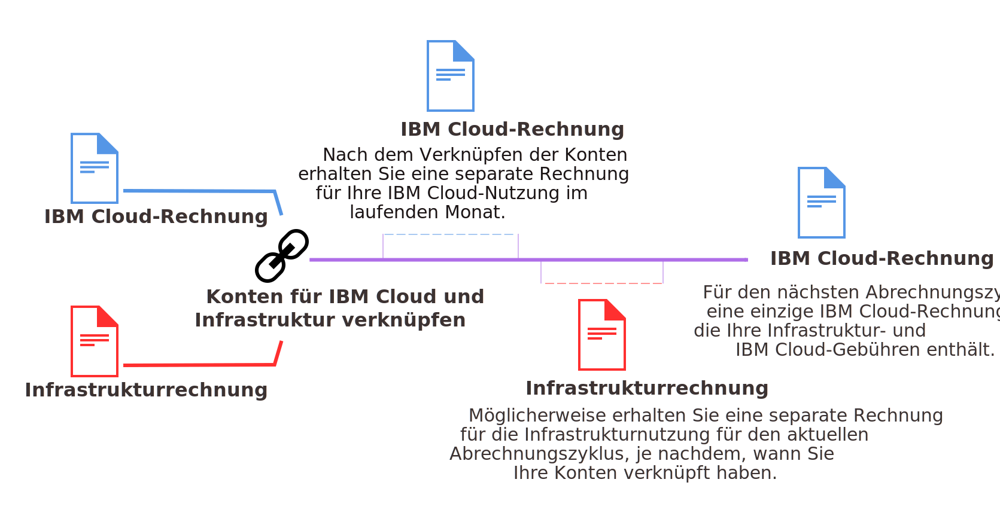

---

copyright:

  years: 2015, 2018
lastupdated: "2018-04-12"

---

{:shortdesc: .shortdesc}
{:codeblock: .codeblock}
{:screen: .screen}
{:tip: .tip}
{:new_window: target="_blank"}

# Konsolidierte Rechnungsstellung für verknüpfte Konten
{: #unifybillaccounts}

Wenn Sie Ihr {{site.data.keyword.Bluemix_notm}}- und Ihr Softlayer-Konto miteinander verknüpfen, erhalten Sie nur eine {{site.data.keyword.Bluemix_notm}}-Abrechnung. Wenn Sie über ein bestehendes {{site.data.keyword.Bluemix_notm}}-Konto verfügen, erfolgt die Rechnungsstellung für Infrastrukturressourcen über {{site.data.keyword.Bluemix_notm}} ab dem neuen Abrechnungszyklus, der nach dem Verknüpfen der Konten beginnt.
{: shortdesc}

Alle verknüpften Konten in {{site.data.keyword.Bluemix_notm}} müssen nutzungsabhängige oder Abonnementkonten sein.
{: tip}

## Rechnungsstellung für {{site.data.keyword.Bluemix_notm}}-Nutzung bei verknüpften Konten
{: #linkedbilling}

Nach der Verknüpfung Ihrer {{site.data.keyword.Bluemix_notm}}- und SoftLayer-Abrechnungskonten erfolgt die Rechnungsstellung im nächsten Abrechnungszyklus über eine einzige {{site.data.keyword.Bluemix_notm}}-Rechnung.

Der {{site.data.keyword.Bluemix_notm}}-Nutzungszyklus basiert auf Kalendermonaten, sodass Ihr Konto monatlich an dem Abrechnungstag abgerechnet wird, der in der Gebührenvereinbarung festgelegt wurde. Bei SoftLayer beginnt der Nutzungszyklus mit dem Beginn der SoftLayer-Nutzung, sodass die Rechnungsstellung jeden Monat an dem Tag erfolgt, an dem Sie sich für Ihr SoftLayer-Konto angemeldet haben.

Ihre {{site.data.keyword.Bluemix_notm}}-Nutzung wird für den aktuellen Monat noch wie bisher abgerechnet und Sie erhalten für diesen Nutzungszeitraum eine {{site.data.keyword.Bluemix_notm}}-Rechnung. Ab dem Ersten des Folgemonats werden Ihre {{site.data.keyword.Bluemix_notm}}- und SoftLayer-Gebühren zusammen über Ihre {{site.data.keyword.Bluemix_notm}}-Rechnung abgerechnet.

Wenn Sie Ihre Konten beispielsweise am 16. April 2017 verknüpfen, erhalten Sie für die Nutzung im April eine {{site.data.keyword.Bluemix_notm}}-Rechnung. Je nach Zeitpunkt der Verknüpfung Ihrer Konten erhalten Sie möglicherweise eine separate Rechnung für Ihre SoftLayer-Nutzung. Die kombinierte Nutzung im Monat Mai wird dann über Ihr {{site.data.keyword.Bluemix_notm}}-Konto abgerechnet.

Nach der Verknüpfung Ihrer Rechnungen werden in Ihrer {{site.data.keyword.Bluemix_notm}}-Rechnung die verschiedenen Gebühren für jede Ressource aufgelistet, die Sie verwendet haben.

## API-basierte {{site.data.keyword.Bluemix_notm}}-Services
{: #api-based-services}

Die folgende Liste enthält die Services, die zur Ausführung mit dem Anwendungscode eingerichtet werden können. Nicht alle Pläne für diese Services stehen für die Verwendung mit verknüpften Konten zur Verfügung. Für verknüpfte Konten können nur die für nutzungsabhängige Konten und für Abonnementkonten aktivierten Pläne verwendet werden. Wenn Sie jedoch über ein separates {{site.data.keyword.Bluemix_notm}}-Konto mit separater Rechnungsstellung verfügen, können Sie beliebige Pläne für diese Services verwenden.

* {{site.data.keyword.alertnotificationshort}}
* {{site.data.keyword.sparks}}
* {{site.data.keyword.appseccloudshort}}
* {{site.data.keyword.blockchain}}
* {{site.data.keyword.cloudant}}
* {{site.data.keyword.iotmapinsights_short}}
* {{site.data.keyword.dashdbshort}}
* {{site.data.keyword.weather_short}}
* {{site.data.keyword.iotdriverinsights_short}}
* {{site.data.keyword.geospatialshort_Geospatial}}
* {{site.data.keyword.iotelectronics}}
* {{site.data.keyword.languagetranslationshort}}
* {{site.data.keyword.messagehub}}
* {{site.data.keyword.nlclassifiershort}}
* {{site.data.keyword.objectstorageshort}}
* {{site.data.keyword.personalityinsightsshort}}
* {{site.data.keyword.servicediscoveryshort}}
* {{site.data.keyword.speechtotextshort}}
* {{site.data.keyword.sqldb}}
* {{site.data.keyword.streaminganalyticsshort}}
* {{site.data.keyword.texttospeechshort}}
* {{site.data.keyword.toneanalyzershort}}
* {{site.data.keyword.visualrecognitionshort}}
* {{site.data.keyword.workloadscheduler}}
