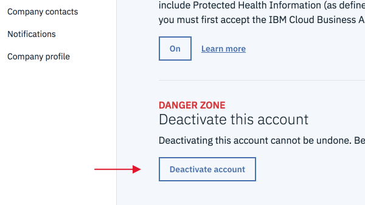

---

copyright:

  years: 2015, 2018

lastupdated: "2018-11-16"

---

{:shortdesc: .shortdesc}
{:codeblock: .codeblock}
{:screen: .screen}
{:new_window: target="_blank"}
{:faq: data-hd-content-type='faq'}

# Preguntas más frecuentes
{: #billusagefaqs} 

## ¿Cómo puedo actualizar mi tarjeta de crédito?
{: #updatecard}
{: faq}

Para añadir o cambiar los detalles del pago, vaya a **Gestionar > Facturación y uso** en la consola de {{site.data.keyword.Bluemix}} y seleccione **Pagos**. Luego pulse **Método de pago**.

## ¿Por qué no funciona mi tarjeta de crédito?
{: #addcard}
{: faq}

Proteger su identidad es una prioridad para nosotros, por ello nos tomamos la verificación de las tarjetas de crédito muy seriamente. Póngase en contacto con nosotros por teléfono en el siguiente número.  

   * Llámenos: 1-866-325-0045 (Seleccione la opción 3)

## ¿Los códigos de características son lo mismo que los códigos promocionales? 
{: #entercode}
{: faq}

Los códigos de característica y de promoción no son los mismos. Los códigos de promoción son específicos de la infraestructura y se especifican en el momento de realizar el pago para obtener un descuento en un pedido. Los códigos de característica se utilizan para ofrecer recursos o funciones adicionales para las cuentas Lite y se necesitan para añadir créditos de suscripción y de soporte a las cuentas de pago según uso y de suscripción. Para canjear su código de característica, vaya a **Gestionar > Cuenta** y seleccione **Valores de cuenta**. Luego pulse **Aplicar código**. 

## ¿Cómo puedo cancelar mi cuenta?
{: #cancelmyaccount}
{: faq}

Si tiene un tipo de cuenta apto, vaya a **Gestionar** > **Cuenta** > **Valores de cuenta** y pulse **Desactivar cuenta**. 

Si va a la página **Valores de cuenta** y no se muestra la opción **Desactivar cuenta**, puede llamar al teléfono 1-866-325-0045 y seleccionar la tercera opción o bien puede abrir un [caso de soporte](https://{DomainName}/unifiedsupport/supportcenter){: new_window} .

## ¿Cómo puedo suprimir mi cuenta?
{: #deleteaccount}
{: faq}

Póngase en contacto con el [equipo de soporte de {{site.data.keyword.Bluemix_notm}} ](https://{DomainName}/unifiedsupport/supportcenter){: new_window} para abrir un caso de soporte y solicitar la supresión de su cuenta. Si tiene datos asociados con su antigua cuenta que desea moverlos a una nueva cuenta, incluya esta información en su correo electrónico.

## ¿Cómo obtengo soporte?
{: #contactsupport}
{: faq}

Pulse **Soporte** en la barra de menús de la consola para acceder al centro de soporte. Desde ahí, empiece por consultar la lista de preguntas frecuentes. Si no encuentra las respuestas que necesita, pulse **Crear un caso** para poderse en contacto con el equipo de soporte.   

## ¿Cuántas apps puedo compilar?
{: #howmanyapps}
{: faq}

En una cuenta Lite, sus apps disponen de hasta 256 MB de memoria de tiempo de ejecución instantánea. Puede desplegar apps hasta que utilice toda la concesión disponible de memoria de la cuenta Lite. Si necesita más memoria, actualice a una cuenta facturable para obtener 512 MB de memoria de tiempo de ejecución instantánea gratuita y pague solo cuando sobrepase este límite. No hay límites en el número de apps que puede compilar en una cuenta facturable. 

## ¿Qué sucede si mi instancia del plan Lite alcanza la cuota mensual?
{: #monthlyquota}
{: faq}

Si alcanza cualquier límite de cuota de las instancias del plan Lite, el servicio para ese mes quedará suspendido. Los límites de cuota son por organización, no por instancia. Las nuevas instancias creadas en la misma organización muestran el uso de instancias anteriores. Los límites de cuota se restablecen el primer día del mes.

## ¿Qué puedo solicitar con mi cuenta de Suscripción? 
{: #subs-order}
{: faq}

Puede solicitar ofertas de plataforma y de infraestructura del catálogo de {{site.data.keyword.Bluemix_notm}}. 

## ¿Cómo puedo optar a un descuento en una cuenta de Suscripción? 
{: #subs-discount}
{: faq}

Para optar a un descuento en el precio, debe comprometerse a un gasto mínimo combinado y un compromiso de permanencia de 100,00 dólares USD cada mes durante 12 meses. 

## ¿Hay una cantidad mínima mensual necesaria para las cuentas de Suscripción? 
{: #subs-minimum}
{: faq}

Sí, debe gastar un mínimo de 100,00 dólares USD cada mes.

## ¿Qué se me cobrará si supero la cantidad total de mi Suscripción?
{: #subs-overage}
{: faq}

Se le cobrará la tarifa sin descuento para cualquier uso que supere la cantidad de suscripción total.

## ¿Puedo pagar el compromiso total de gasto por adelantado o de forma trimestral?
{: #subs-pay-schedule}
{: faq}

Actualmente, puede hacer pagos mensuales a su cuenta de Suscripción. Si desea pagar por adelantado o de forma trimestral, póngase en contacto con [Ventas de {{site.data.keyword.Bluemix_notm}}](https://www.ibm.com/cloud-computing/bluemix/contact-us){: new_window} .

## ¿Puedo gastar más o menos que mi compromiso mensual?  
{: #subs-spending}
{: faq}

Sí, lo que gaste mensualmente depende de usted. Puede gastar cualquier cantidad del compromiso total cada mes. 

## ¿Puedo cancelar mi cuenta de Suscripción antes del final de mi compromiso de permanencia?  
{: #subs-cancel-early}
{: faq}

Sí, puede cancelar su cuenta antes de que finalice el plazo, pero el resto de la cantidad total de Suscripción se perderá. 

## ¿Qué ocurre si llego a mi compromiso de gasto antes de que finalice mi término?  
{: #subs-spend-before-term-end}
{: faq}

Tendrá que seguir pagando sus cargos mensuales hasta el final del término. Para evitar generar cargos en exceso, póngase en contacto con [Ventas de {{site.data.keyword.Bluemix_notm}}](https://www.ibm.com/cloud-computing/bluemix/contact-us){: new_window}  para obtener ayuda con la firma de una Suscripción nueva. 

## ¿Dónde puedo acceder a mi factura?
{: #access-invoices}
{: faq}

En la consola, pulse **Gestionar > Facturación y uso** y seleccione **Facturas**.

## ¿Por qué mi uso no coincide con mi factura?
{: #usage-not-match-invoice}
{: faq}

Es posible que su uso no coincida con su factura, porque los meses que se utilizan para comparar el uso no son los mismos, o bien no se ha seleccionado la cantidad total de las organizaciones. Para obtener más información, consulte
[Visualización del uso](/docs/billing-usage/viewing_usage.html#viewingusage). Si todavía no coincide, póngase en contacto con nosotros llamando al 1-866-325-0045 y seleccionando la tercera opción, o abriendo una [incidencia al soporte](/unifiedsupport/cases/add).

