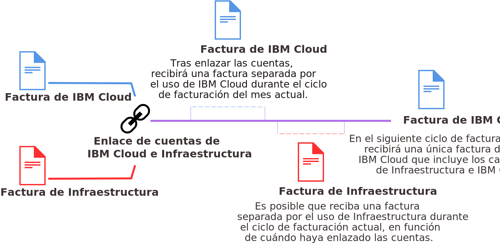

---

copyright:

  years: 2015, 2018
lastupdated: "2018-04-12"

---

{:shortdesc: .shortdesc}
{:codeblock: .codeblock}
{:screen: .screen}
{:tip: .tip}
{:new_window: target="_blank"}

# Facturación consolidada para cuentas enlazadas
{: #unifybillaccounts}

Cuando enlaza las cuentas de {{site.data.keyword.Bluemix_notm}} y Softlayer, recibe una factura única de {{site.data.keyword.Bluemix_notm}}. Si tiene una cuenta de {{site.data.keyword.Bluemix_notm}}, la facturación a través de {{site.data.keyword.Bluemix_notm}} para los recursos de infraestructura será efectiva para el nuevo ciclo de facturación que empieza una vez que se hayan enlazado las cuentas.
{: shortdesc}

Todas las cuentas enlazadas en {{site.data.keyword.Bluemix_notm}} deben ser cuentas de pagos según uso o de suscripción.
{: tip}

## Facturación para el uso de {{site.data.keyword.Bluemix_notm}} cuando las cuentas están enlazadas
{: #linkedbilling}

Una vez haya enlazado las cuentas de facturación de {{site.data.keyword.Bluemix_notm}} y SoftLayer, el siguiente ciclo de facturación se cargará en una única factura de {{site.data.keyword.Bluemix_notm}}.

El ciclo de uso de {{site.data.keyword.Bluemix_notm}} se basa en meses naturales, por lo que la cuenta se factura cada mes el día de facturación que se estableció para su acuerdo de cargo. Con SoftLayer, el ciclo de uso empieza al empezar a utilizar SoftLayer, por lo que la facturación es cada mes, el día en el que se registró para la cuenta de SoftLayer.

El uso de {{site.data.keyword.Bluemix_notm}} seguirá midiéndose para el ciclo mensual actual y dicho uso se facturará en una factura de {{site.data.keyword.Bluemix_notm}}. A partir del día 1 del siguiente mes, los cargos de {{site.data.keyword.Bluemix_notm}} y SoftLayer se combinarán en la factura de {{site.data.keyword.Bluemix_notm}}.

Por ejemplo, si enlaza las cuentas el 16 de abril de 2017, recibirá una factura de {{site.data.keyword.Bluemix_notm}} para su uso de abril. Según cuándo haya enlazado las cuentas, podrá obtener una factura independiente para el uso de SoftLayer. A continuación, el uso combinado durante mayo se facturará mediante su cuenta de {{site.data.keyword.Bluemix_notm}}.

Una vez que se enlacen las facturas, la factura de {{site.data.keyword.Bluemix_notm}} listará los distintos cargos para cada recurso que haya utilizado.

## Servicios de {{site.data.keyword.Bluemix_notm}} basados en API
{: #api-based-services}

En la siguiente lista encontrará los servicios que puede configurar para ejecutarlos con su código de aplicación. No todos los planes para estos servicios están disponibles para su utilización con cuentas enlazadas. Para utilizar con las cuentas enlazadas, solo están disponibles los planes habilitados para cuentas de Suscripción y de Pago según uso. Sin embargo, si tiene una cuenta de {{site.data.keyword.Bluemix_notm}} separada que también se factura de forma separada, puede utilizar cualquier plan para cualquiera de estos servicios.

* {{site.data.keyword.alertnotificationshort}}
* {{site.data.keyword.sparks}}
* {{site.data.keyword.appseccloudshort}}
* {{site.data.keyword.blockchain}}
* {{site.data.keyword.cloudant}}
* {{site.data.keyword.iotmapinsights_short}}
* {{site.data.keyword.dashdbshort}}
* {{site.data.keyword.weather_short}}
* {{site.data.keyword.iotdriverinsights_short}}
* {{site.data.keyword.geospatialshort_Geospatial}}
* {{site.data.keyword.iotelectronics}}
* {{site.data.keyword.languagetranslationshort}}
* {{site.data.keyword.messagehub}}
* {{site.data.keyword.nlclassifiershort}}
* {{site.data.keyword.objectstorageshort}}
* {{site.data.keyword.personalityinsightsshort}}
* {{site.data.keyword.servicediscoveryshort}}
* {{site.data.keyword.speechtotextshort}}
* {{site.data.keyword.sqldb}}
* {{site.data.keyword.streaminganalyticsshort}}
* {{site.data.keyword.texttospeechshort}}
* {{site.data.keyword.toneanalyzershort}}
* {{site.data.keyword.visualrecognitionshort}}
* {{site.data.keyword.workloadscheduler}}
