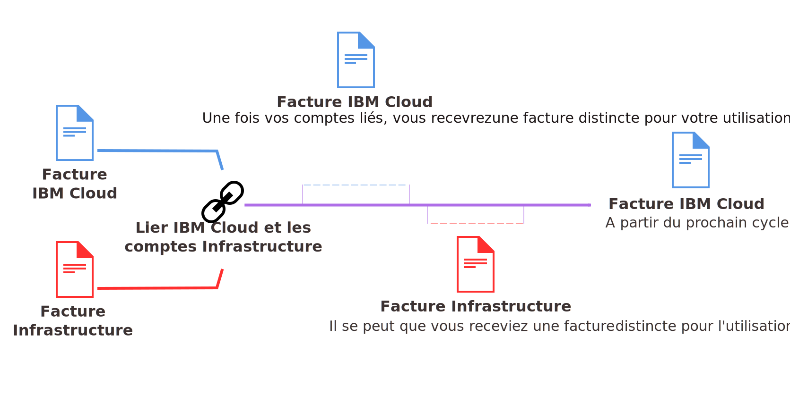

---

copyright:

  years: 2015, 2018
lastupdated: "2018-04-12"

---

{:shortdesc: .shortdesc}
{:codeblock: .codeblock}
{:screen: .screen}
{:tip: .tip}
{:new_window: target="_blank"}

# Facturation en bloc pour des comptes liés
{: #unifybillaccounts}

Si vous liez vos comptes {{site.data.keyword.Bluemix_notm}} et SoftLayer, vous ne recevez qu'une seule facture {{site.data.keyword.Bluemix_notm}}. Si vous disposez d'un compte {{site.data.keyword.Bluemix_notm}}, la facturation via {{site.data.keyword.Bluemix_notm}} pour les ressources d'infrastructure entre en vigueur au prochain cycle de facturation après que les comptes ont été liés.
{: shortdesc}

Tous les comptes liés dans {{site.data.keyword.Bluemix_notm}} doivent être de type Paiement à la carte ou Abonnement.
{: tip}

## Facturation pour l'utilisation de {{site.data.keyword.Bluemix_notm}} lorsque les comptes sont liés
{: #linkedbilling}

Une fois que vous avez lié vos comptes {{site.data.keyword.Bluemix_notm}} et SoftLayer, le cycle de facturation suivant est imputé dans une seule facture {{site.data.keyword.Bluemix_notm}}.

Votre cycle d'utilisation de {{site.data.keyword.Bluemix_notm}} est basé sur le mois calendaire et votre compte sera facturé chaque mois le jour de facturation établi pour votre contrat de crédit. Avec SoftLayer, votre cycle d'utilisation débute au moment où vous avez commencé à utiliser SoftLayer, et vous êtes donc facturé chaque mois le même jour où vous avez ouvert votre compte SoftLayer.

Votre utilisation de {{site.data.keyword.Bluemix_notm}} continue d'être mesurée pour le cycle du mois en cours et vous êtes facturé pour cette utilisation sur une facture {{site.data.keyword.Bluemix_notm}}. A compter du premier jour du mois suivant, vos frais {{site.data.keyword.Bluemix_notm}} et SoftLayer sont combinés sur votre facture {{site.data.keyword.Bluemix_notm}}.

Par exemple, si vous liez vos comptes le 16 avril 2017, vous recevez une facture {{site.data.keyword.Bluemix_notm}} pour votre consommation d'avril. Selon la date à laquelle vous avez lié vos comptes, vous pouvez recevoir une facture distincte pour votre utilisation de SoftLayer. Ensuite, votre utilisation combinée du mois de mai est facturée via votre compte {{site.data.keyword.Bluemix_notm}}.

Une fois vos factures liées, votre facture {{site.data.keyword.Bluemix_notm}} répertorie les prix de chaque ressource que vous avez utilisée.

## Services {{site.data.keyword.Bluemix_notm}} reposant sur des API
{: #api-based-services}

La liste suivante recense les services que vous pouvez configurer pour exécution avec votre code d'application. Les plans pour ces services ne sont pas tous disponibles pour utilisation avec des comptes liés. Seuls les plans activés pour les comptes de type Paiement à la carte et Abonnement peuvent être utilisés avec des comptes liés. Toutefois, si vous disposez d'un compte {{site.data.keyword.Bluemix_notm}} distinct qui est facturé séparément, vous pouvez utiliser n'importe quel plan associé à l'un de ces services.

* {{site.data.keyword.alertnotificationshort}}
* {{site.data.keyword.sparks}}
* {{site.data.keyword.appseccloudshort}}
* {{site.data.keyword.blockchain}}
* {{site.data.keyword.cloudant}}
* {{site.data.keyword.iotmapinsights_short}}
* {{site.data.keyword.dashdbshort}}
* {{site.data.keyword.weather_short}}
* {{site.data.keyword.iotdriverinsights_short}}
* {{site.data.keyword.geospatialshort_Geospatial}}
* {{site.data.keyword.iotelectronics}}
* {{site.data.keyword.languagetranslationshort}}
* {{site.data.keyword.messagehub}}
* {{site.data.keyword.nlclassifiershort}}
* {{site.data.keyword.objectstorageshort}}
* {{site.data.keyword.personalityinsightsshort}}
* {{site.data.keyword.servicediscoveryshort}}
* {{site.data.keyword.speechtotextshort}}
* {{site.data.keyword.sqldb}}
* {{site.data.keyword.streaminganalyticsshort}}
* {{site.data.keyword.texttospeechshort}}
* {{site.data.keyword.toneanalyzershort}}
* {{site.data.keyword.visualrecognitionshort}}
* {{site.data.keyword.workloadscheduler}}
