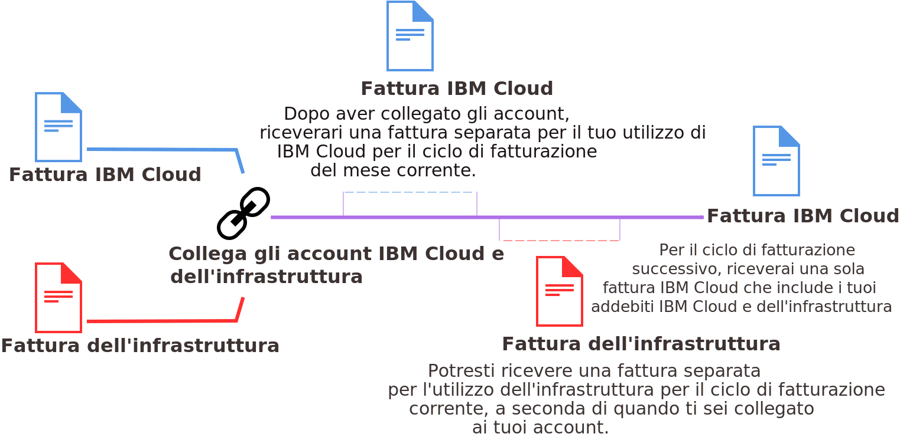

---

copyright:

  years: 2015, 2018
lastupdated: "2018-04-12"

---

{:shortdesc: .shortdesc}
{:codeblock: .codeblock}
{:screen: .screen}
{:tip: .tip}
{:new_window: target="_blank"}

# Fatturazione consolidata per gli account collegati
{: #unifybillaccounts}

Quando colleghi gli account {{site.data.keyword.Bluemix_notm}} e Softlayer, ricevi un'unica fattura {{site.data.keyword.Bluemix_notm}}. Se hai un account {{site.data.keyword.Bluemix_notm}} esistente, la fatturazione tramite {{site.data.keyword.Bluemix_notm}} per le risorse dell'infrastruttura parte dal nuovo ciclo di fatturazione che inizia dopo il collegamento degli account.
{: shortdesc}

Tutti gli account collegati in {{site.data.keyword.Bluemix_notm}} devono essere del tipo Pagamento a consumo o Sottoscrizione.
{: tip}

## Fatturazione per l'utilizzo di {{site.data.keyword.Bluemix_notm}} con gli account collegati
{: #linkedbilling}

Una volta collegati i tuoi account di fatturazione {{site.data.keyword.Bluemix_notm}} e SoftLayer, il successivo ciclo di fatturazione viene addebitato in un'unica fattura {{site.data.keyword.Bluemix_notm}}.

Il tuo ciclo di utilizzo di {{site.data.keyword.Bluemix_notm}} si basa sul mese di calendario, perciò l'addebito per il tuo account viene effettuato con cadenza mensile il giorno di fatturazione stabilito nel tuo accordo di addebito. Con SoftLayer, il ciclo di utilizzo inizia nel momento in cui viene avviato e viene pertanto addebitato con cadenza mensile lo stesso giorno del mese in cui hai sottoscritto l'account SoftLayer.

Il tuo utilizzo di {{site.data.keyword.Bluemix_notm}} continua a essere misurato per il ciclo del mese corrente e ti viene addebitato su una fattura {{site.data.keyword.Bluemix_notm}}. A partire dal primo giorno del mese successivo, gli addebiti di {{site.data.keyword.Bluemix_notm}} e SoftLayer vengono combinati nella tua fattura {{site.data.keyword.Bluemix_notm}}.

Ad esempio, se colleghi i tuoi account il 16 aprile 2017, ricevi una fattura {{site.data.keyword.Bluemix_notm}} per l'utilizzo del mese di aprile. A seconda di quando hai collegato i tuoi account, potresti ricevere una fattura separata per l'utilizzo di SoftLayer. Quindi, l'utilizzo combinato durante il mese di maggio viene fatturato tramite l'account {{site.data.keyword.Bluemix_notm}}.

Una volta collegate le fatture, la tua fattura {{site.data.keyword.Bluemix_notm}} elencherà i diversi addebiti per ogni risorsa che hai utilizzato.

## Servizi {{site.data.keyword.Bluemix_notm}} basati sull'API
{: #api-based-services}

Il seguente elenco contiene i servizi che puoi configurare per l'esecuzione con il tuo codice applicativo. Non tutti i piani per questi servizi sono disponibili per l'uso con gli account collegati. Solo i piani abilitati per gli account Pagamento a consumo e Sottoscrizione possono essere utilizzati con gli account collegati. Tuttavia, se hai un account {{site.data.keyword.Bluemix_notm}} che viene fatturato separatamente, puoi utilizzare qualsiasi piano per tutti questi servizi.

* {{site.data.keyword.alertnotificationshort}}
* {{site.data.keyword.sparks}}
* {{site.data.keyword.appseccloudshort}}
* {{site.data.keyword.blockchain}}
* {{site.data.keyword.cloudant}}
* {{site.data.keyword.iotmapinsights_short}}
* {{site.data.keyword.dashdbshort}}
* {{site.data.keyword.weather_short}}
* {{site.data.keyword.iotdriverinsights_short}}
* {{site.data.keyword.geospatialshort_Geospatial}}
* {{site.data.keyword.iotelectronics}}
* {{site.data.keyword.languagetranslationshort}}
* {{site.data.keyword.messagehub}}
* {{site.data.keyword.nlclassifiershort}}
* {{site.data.keyword.objectstorageshort}}
* {{site.data.keyword.personalityinsightsshort}}
* {{site.data.keyword.servicediscoveryshort}}
* {{site.data.keyword.speechtotextshort}}
* {{site.data.keyword.sqldb}}
* {{site.data.keyword.streaminganalyticsshort}}
* {{site.data.keyword.texttospeechshort}}
* {{site.data.keyword.toneanalyzershort}}
* {{site.data.keyword.visualrecognitionshort}}
* {{site.data.keyword.workloadscheduler}}
