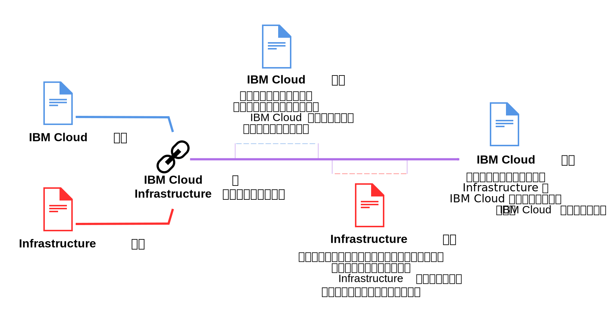

---

copyright:

  years: 2015, 2018
lastupdated: "2018-04-12"

---

{:shortdesc: .shortdesc}
{:codeblock: .codeblock}
{:screen: .screen}
{:tip: .tip}
{:new_window: target="_blank"}

# リンクされたアカウントの統合請求
{: #unifybillaccounts}

{{site.data.keyword.Bluemix_notm}} アカウントと Softlayer アカウントをリンクすると、単一の {{site.data.keyword.Bluemix_notm}} 請求書を受け取ることになります。 既存の {{site.data.keyword.Bluemix_notm}} アカウントがある場合、インフラストラクチャー・リソースに対する {{site.data.keyword.Bluemix_notm}} からの請求は、両方のアカウントをリンクした後に開始される新しい請求処理サイクルで有効になります。
{: shortdesc}

{{site.data.keyword.Bluemix_notm}} でリンクされるアカウントはすべて、従量課金 (PAYG) アカウントまたはサブスクリプション・アカウントでなければなりません。
{: tip}

## アカウントがリンクされている場合の {{site.data.keyword.Bluemix_notm}} 使用量に対する請求処理
{: #linkedbilling}

{{site.data.keyword.Bluemix_notm}} と SoftLayer の請求アカウントをリンクすると、次の請求処理サイクルは、単一の {{site.data.keyword.Bluemix_notm}} 請求書で請求されます。

{{site.data.keyword.Bluemix_notm}} の使用量サイクルは暦月ベースであるため、アカウントは毎月、課金契約に設定された請求日に請求されます。 SoftLayer では、使用量サイクルは、SoftLayer の使用を開始したときから始まるため、毎月、SoftLayer アカウントを登録したときと同じ日に請求されます。

{{site.data.keyword.Bluemix_notm}} の使用量の測定は、引き続き現行月のサイクルを対象として行われ、その使用量の料金は {{site.data.keyword.Bluemix_notm}} の請求書で請求されます。 翌月の初めから、{{site.data.keyword.Bluemix_notm}} と SoftLayer の課金が、{{site.data.keyword.Bluemix_notm}} 請求書で結合されるようになります。

例えば、2017年 4 月 16 日にアカウントをリンクした場合、4 月の使用量については {{site.data.keyword.Bluemix_notm}} の請求書を受け取ります。 アカウントをリンクしたタイミングによっては、SoftLayer 使用量に対して別個の請求書を受け取ることがあります。 その後、5 月中の結合された使用量の料金が、{{site.data.keyword.Bluemix_notm}} アカウントから請求されます。

請求書がリンクされた後には、{{site.data.keyword.Bluemix_notm}} 請求書には、使用した各リソースに対する別個の料金がリストされます。

## API ベースの {{site.data.keyword.Bluemix_notm}} サービス
{: #api-based-services}

以下のリストに含まれているサービスは、アプリケーション・コードを使用して実行するようにセットアップできます。 これらのサービスのすべてのプランが、リンクされたアカウントで使用できるわけではありません。 リンクされたアカウントで使用できるのは、従量課金 (PAYG) アカウント用およびサブスクリプション・アカウント用に有効になっているプランのみです。 ただし、個別に請求される個別の {{site.data.keyword.Bluemix_notm}} アカウントがある場合には、これらのすべてのサービスのすべてのプランを使用できます。

* {{site.data.keyword.alertnotificationshort}}
* {{site.data.keyword.sparks}}
* {{site.data.keyword.appseccloudshort}}
* {{site.data.keyword.blockchain}}
* {{site.data.keyword.cloudant}}
* {{site.data.keyword.iotmapinsights_short}}
* {{site.data.keyword.dashdbshort}}
* {{site.data.keyword.weather_short}}
* {{site.data.keyword.iotdriverinsights_short}}
* {{site.data.keyword.geospatialshort_Geospatial}}
* {{site.data.keyword.iotelectronics}}
* {{site.data.keyword.languagetranslationshort}}
* {{site.data.keyword.messagehub}}
* {{site.data.keyword.nlclassifiershort}}
* {{site.data.keyword.objectstorageshort}}
* {{site.data.keyword.personalityinsightsshort}}
* {{site.data.keyword.servicediscoveryshort}}
* {{site.data.keyword.speechtotextshort}}
* {{site.data.keyword.sqldb}}
* {{site.data.keyword.streaminganalyticsshort}}
* {{site.data.keyword.texttospeechshort}}
* {{site.data.keyword.toneanalyzershort}}
* {{site.data.keyword.visualrecognitionshort}}
* {{site.data.keyword.workloadscheduler}}
