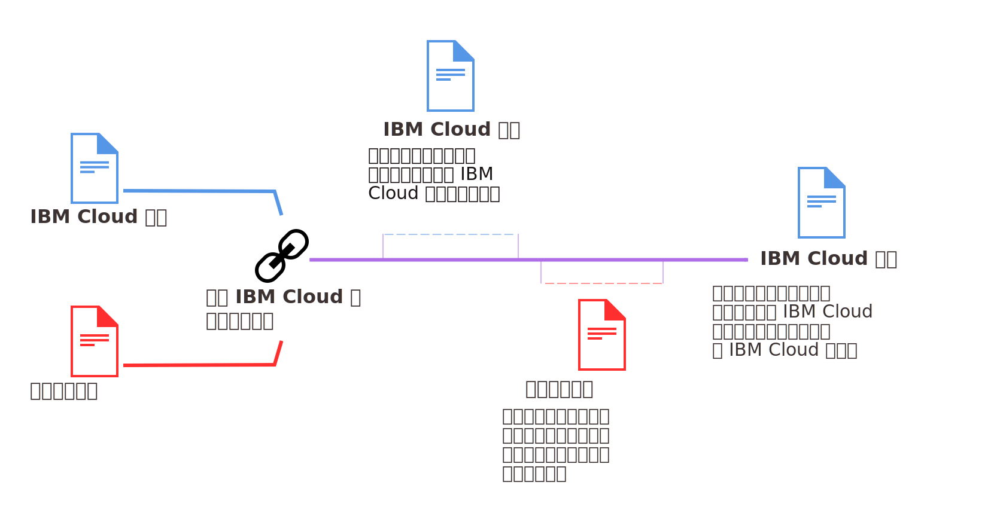

---

copyright:

  years: 2015, 2018
lastupdated: "2018-04-12"

---

{:shortdesc: .shortdesc}
{:codeblock: .codeblock}
{:screen: .screen}
{:tip: .tip}
{:new_window: target="_blank"}

# 已鏈結帳戶的合併計費
{: #unifybillaccounts}

當您鏈結 {{site.data.keyword.Bluemix_notm}} 與 Softlayer 帳戶時，會收到一張 {{site.data.keyword.Bluemix_notm}} 發票。如果您有現有的 {{site.data.keyword.Bluemix_notm}} 帳戶，則會在鏈結帳戶之後開始的新計費週期，透過 {{site.data.keyword.Bluemix_notm}} 收取基礎架構資源的費用。
{: shortdesc}

{{site.data.keyword.Bluemix_notm}} 中的所有已鏈結帳戶都必須是「隨收隨付制」或訂閱帳戶。
{: tip}

## 帳戶鏈結後的 {{site.data.keyword.Bluemix_notm}} 用量計費
{: #linkedbilling}

鏈結 {{site.data.keyword.Bluemix_notm}} 與 SoftLayer 計費帳戶之後，將以一張 {{site.data.keyword.Bluemix_notm}} 帳單收取下一個計費週期的費用。

您的 {{site.data.keyword.Bluemix_notm}} 使用週期是以行事曆月份為基準，所以會在收費合約成立的帳單日，每個月向您的帳戶收費。使用 SoftLayer 時，您的使用週期是從 SoftLayer 起始使用日開始，所以會以 SoftLayer 帳戶註冊當月的相同日期，每月向您收費。

會繼續測量當月週期的 {{site.data.keyword.Bluemix_notm}} 用量，並且會在 {{site.data.keyword.Bluemix_notm}} 發票上向您收取該用量的費用。從下個月 1 日開始，{{site.data.keyword.Bluemix_notm}} 及 SoftLayer 費用會併入 {{site.data.keyword.Bluemix_notm}} 發票。

例如，如果您在 2017 年 4 月 16 日鏈結帳戶，則會收到 4 月用量的 {{site.data.keyword.Bluemix_notm}} 發票。視鏈結帳戶的時間而定，您可能會收到 SoftLayer 用量的個別帳單。然後，您在 5 月期間的合併用量會透過 {{site.data.keyword.Bluemix_notm}} 帳戶向您收費。

鏈結帳單之後，{{site.data.keyword.Bluemix_notm}} 發票即會針對您所使用的每一項資源列出不同費用：

## API 型 {{site.data.keyword.Bluemix_notm}} 服務
{: #api-based-services}

下列清單包含可設定為與您的應用程式碼搭配執行的服務。並非這些服務的所有方案都可以與已鏈結帳戶搭配使用。只有針對「隨收隨付制」及「訂閱」帳戶啟用的方案，才能用於已鏈結帳戶。不過，如果您有分開計費的個別 {{site.data.keyword.Bluemix_notm}} 帳戶，則可將任何方案用於上述任何服務。

* {{site.data.keyword.alertnotificationshort}}
* {{site.data.keyword.sparks}}
* {{site.data.keyword.appseccloudshort}}
* {{site.data.keyword.blockchain}}
* {{site.data.keyword.cloudant}}
* {{site.data.keyword.iotmapinsights_short}}
* {{site.data.keyword.dashdbshort}}
* {{site.data.keyword.weather_short}}
* {{site.data.keyword.iotdriverinsights_short}}
* {{site.data.keyword.geospatialshort_Geospatial}}
* {{site.data.keyword.iotelectronics}}
* {{site.data.keyword.languagetranslationshort}}
* {{site.data.keyword.messagehub}}
* {{site.data.keyword.nlclassifiershort}}
* {{site.data.keyword.objectstorageshort}}
* {{site.data.keyword.personalityinsightsshort}}
* {{site.data.keyword.servicediscoveryshort}}
* {{site.data.keyword.speechtotextshort}}
* {{site.data.keyword.sqldb}}
* {{site.data.keyword.streaminganalyticsshort}}
* {{site.data.keyword.texttospeechshort}}
* {{site.data.keyword.toneanalyzershort}}
* {{site.data.keyword.visualrecognitionshort}}
* {{site.data.keyword.workloadscheduler}}
