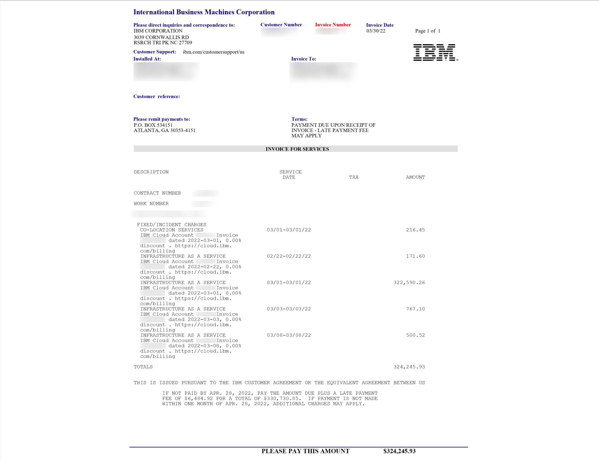
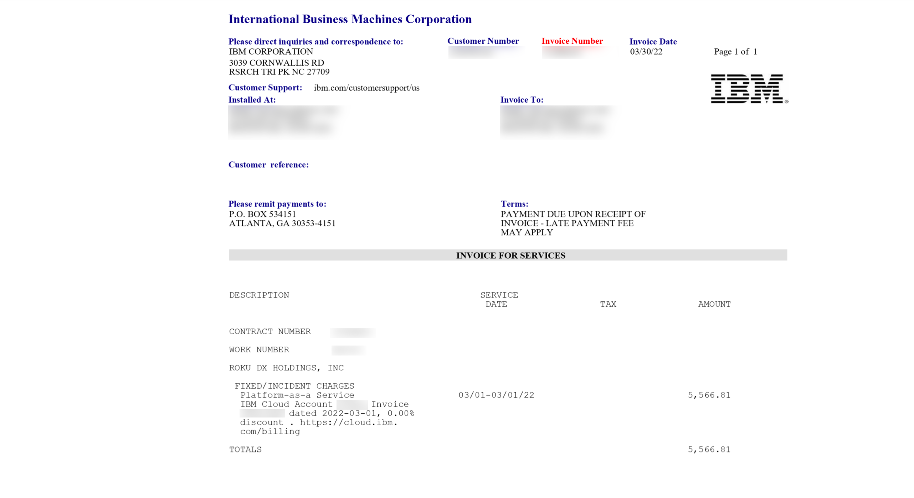
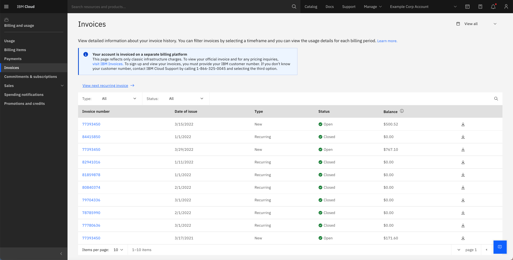

---

copyright:
   years: 2022
lastupdated: "2022-08-30"

keywords: invoice reconciliation, non-subscription invoice, map invoice, map usage, one time charges, recurring invoice, recurring charges

subcollection: billing-usage

content-type: tutorial
account-plan: paid
completion-time: 15m

---

{{site.data.keyword.attribute-definition-list}}

# Reconciling usage for nonsubscription multi-year account invoices
{: #tutorial-reconcile-invoice}
{: toc-content-type="tutorial"}
{: toc-completion-time="45m"}

As an {{site.data.keyword.cloud}} customer with a nonsubscription multi-year account, understanding the different invoices that are available to you can help you understand your monthly cost breakdown.
{: shortdesc}

Final invoice
:   The finalized compilation of charges a user receives at the end of the month.
:   Includes new and one-time charges from the 20th of the prior month to the 19th of the current month. For the examples referenced in this document, the new and one-time charges are from 20 February to 20 March.
:  Includes the recurring charges from the recurring invoice in the {{site.data.keyword.cloud_notm}} console.

Recurring invoice
:  The recurring invoice is a system generated reference invoice that's located in the {{site.data.keyword.cloud_notm}} console. The recurring invoice provides a line item breakdown of each recurring charge. This doesn't include every charge that appears on the final monthly invoice and is not the final invoice that you are charged for.

In this tutorial, you'll see a few invoice examples:

* [Figure 1](/docs/billing-usage?topic=billing-usage-reconcile-invoice#IaaS-PaaS): The Infrastructure as a Service (IaaS) and Platform as a Service (PaaS) invoice for March. This invoice is sent to the email associated with the account.
* [Figure 2](/docs/billing-usage?topic=billing-usage-reconcile-invoice#recurring-console-invoice): The March recurring invoice. You can find your recurring invoice on the [Invoices page](/billing/invoices).
* [Figure 3](/docs/billing-usage?topic=billing-usage-reconcile-invoice#new-charges): A view of the invoice tab in the console with the new and one-time charges from 20 February to 19 March.

## Review the totals on the final invoice
{: #recurring-charge}
{: step}

You receive an IaaS and PaaS invoice each month.

For this example, reference Figure 1. The IaaS invoice total is $324,245.93 USD and the PaaS invoice total is $5566.81 USD. To understand what these totals represent, you must view the recurring console invoice. The recurring invoice in the console provides a line item breakdown of each charge.

{: caption="Figure 1.IaaS and PaaS invoice for the month of March." caption-side="bottom"}
{: caption="Figure 1.IaaS and PaaS invoice for the month of March." caption-side="bottom"}
{: #IaaS-PaaS}

## Identify the recurring charges
{: #recurring-charge-view}
{: step}

Figure 2 represents the recurring charges. To locate these recurring charges, complete the following steps:

1. In the {{site.data.keyword.cloud_notm}} console, go to **Manage** > **Billing and usage**, and select **Invoices**.
1. Click the invoice number. For this example, review the table and click the invoice with a 3/1/22 date of issue and recurring type.
1. To download the recurring invoice, click the **Download** icon  and select Excel invoice.
1. Click **Email selected documents**. You receive an email with the selected documents to the email address of the account that you're logged in to. You can also click the **Download** icon  to download the invoice directly to your device.
1. Open the downloaded file, and click **Summary** tab.

In this example, the Platform Services charge matches the total on the PaaS final invoice from Figure 1: $5,566.81 USD. The remaining charges, which total $322,806.71 USD ($328,373.52 - $5566.81 = $322,806.71) represent the remaining infrastructure, nonplatform charges from this recurring invoice.

{: caption="Figure 2.IaaS recurring charges." caption-side="bottom"}
{: #recurring-console-invoice}

## Identify the new and one-time charges
{: #new-onetime-charge}
{: #step}

Next, you need to identify and find the sum of the new and one time charges. Your new and one-time charges are on the [Invoices page](/billing/invoices) in the console. There are three new charges on the invoices page during this time period: A charge of $500.52, $767.10, and $171.60.

{: caption="Figure 3. New and one-time charges in the console for the month of March." caption-side="bottom"}
{: #new-charges}

The remaining infrastructure charges of $322,806.71 USD from the recurring invoice in the console and the new and one-time charges should add up to the total IaaS final invoice charge of $324,245.93 USD.

## Granular view of the line item charges
{: #understand-line-item-charges}
{: #step}

Now that we confirmed that the final invoice totals match the recurring and new and one time charges in the console, let’s find out what the charges on the final invoice represent.

On the Excel version of your recurring invoice that you downloaded in step 2, click the **Detailed Billing** tab. The Detailed Billing tab provides a breakdown of all of your infrastructure and platform charges. They represent three major types of usage:

* In Advance (for example, the month of March) infrastructure monthly usage charges. These are recurring charges that you incur until you cancel the service. The charge is the same every month.

{: caption="Figure 4. In advance infrastructure monthly usage charges." caption-side="bottom"}

* In Arrears (for example, the month of February) infrastructure hourly charges. These are usage-based charges from the previous month. Note the `672 hrs * .066` format of the charges. In arrears, infrastructure hourly charges are always in this format.

{: caption="Figure 5.In Arrears infrastructure hourly charges." caption-side="bottom"}

* In arrears (for example, the month of January) platform service charges. These are usage-based charges from two months prior. They are labeled Platform service in column B and reference the month in which the usage was consumed.

{: caption="Figure 6. In arrears platform service charges for the month of January." caption-side="bottom"}

## Next steps
{: #cd-kube-step-next}

To continue your learning about your billing and usage, see [Managing payments](/docs/billing-usage?topic=billing-usage-linkedusage),
